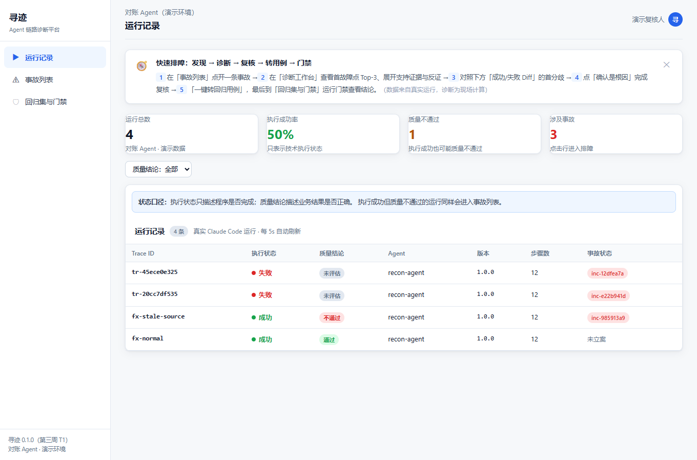
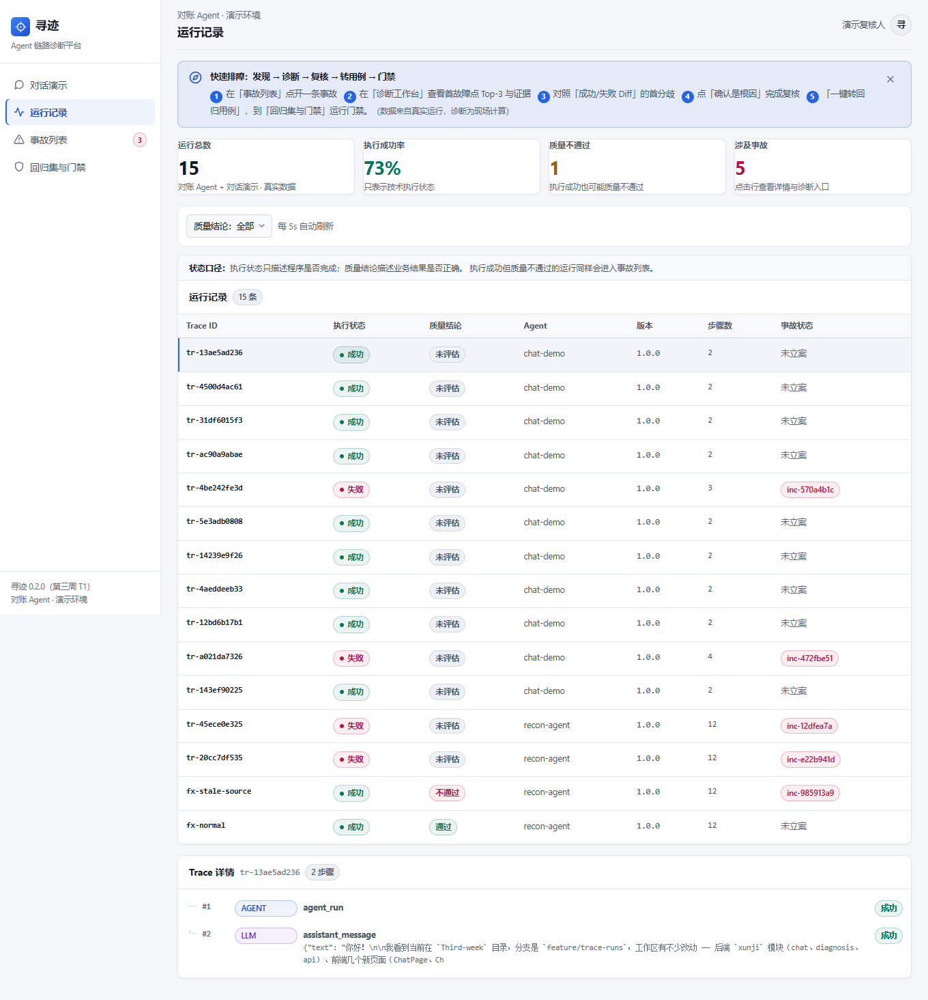
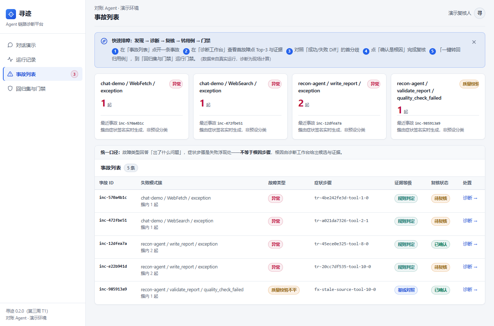
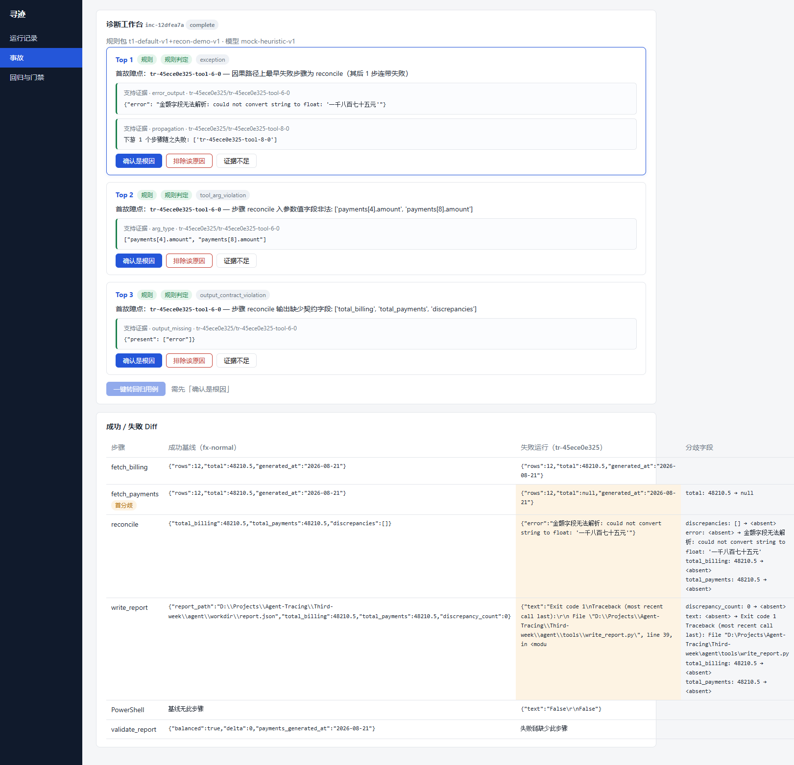
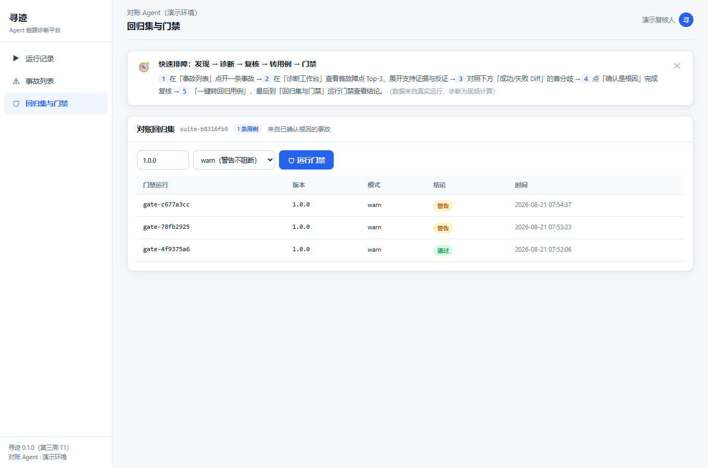

# DEMO：端到端演示脚本

> 真实态 = 本机 Claude Code CLI 现场执行示例 Agent，Trace 实时入库、诊断现场计算；
> 离线态 = 真实运行录制的 fixtures 回放（无网/未装 CLI 可用），诊断同样现场计算。
> **诚实性硬规则**：代码库无任何预写诊断结论（可 `grep -rn "预置\|hardcode" server/` 验证）；
> 改动注入参数（agent/data/ 与 `--inject`）会真实改变诊断结果。

## 0. 前置

```bash
cd Third-week
python -m venv .venv && .venv/Scripts/pip install -r server/requirements.txt   # 国内网络加 -i https://mirrors.aliyun.com/pypi/simple/
cd web && npm install && cd ..          # 国内网络加 --registry https://registry.npmmirror.com
```

真实态另需：已安装并登录 Claude Code CLI（`claude --version` 可用）。

## 1. 启动（一条命令）

```bash
npm run demo        # 后端 :8756 + 前端 :5173
```

启动后有**两套前端**（同一后端、同一数据）：

| 入口 | 定位 | 说明 |
|---|---|---|
| http://127.0.0.1:8756/proto/prototype.html | **业务工作台（主推）** | 中期原型三件套逐字节复制（一处未改），`data.js` 由后端按其数据契约从真实库实时生成；覆盖运行/Trace/事故/工作台/Diff/复核/门禁/体检/设置九页 |
| http://127.0.0.1:8756/chat | **对话演示（独立界面）** | 手动提问 → `xunji run` 包装真实执行 → 回答与 Trace 同步产生，多轮 `--resume` 续接；复用原型 CSS 设计系统 |
| http://localhost:5173 | React 工作台（保留） | 五页真实数据前端 + 对话演示路由页 |

原型九类故障（FM-01~09）是产品叙事口径；`/proto/data.js` 生成器把 T1 六类真实
failure_type 映射为 FM-EX/ARG/CT/TO/RE/QC 六个代号，映射口径在
`server/xunji/protodata.py` 头注释如实声明。

## 2A. 真实态（主路径）

```bash
npm run demo-run    # 依次真实执行：正常（建基线）→ stale-source → broken-contract
```

每次执行都是 `claude -p` 驱动真实模型跑对账任务（读账单 → 读流水 → 核对 → 写报告 → 校验），
`xunji run` 旁路解析 stream-json 实时上报。**正常与注入运行使用同一份
agent/task_prompt.md，差异只来自 `XUNJI_INJECT` 环境变量（工具/数据层）。**

## 2B. 离线态（无网兜底 / CI）

```bash
npm run demo-offline   # 回放 fixtures/*.contract.json（真实录制转换，附录制脚本）
```

## 2C. 对话演示（手动提问 → 真实执行 → Trace 同步产生）

打开 http://localhost:5173/#/chat（侧栏「对话演示」）。输入任意问题并发送：

- 每个问题被后端用 `xunji run` 包装为一次真实的 `claude -p` 执行（需已登录 CLI），
  回答与执行链路同时产生——这是「接入即追踪」的现场演示；
- **多轮对话**：每轮回答带回 claude 会话 ID，下一问自动用 `--resume` 续接同一会话
  （头部显示「多轮会话 xxxx…」标签；点「新对话」重新开始）。每轮仍是独立 Trace，
  一问一链路；
- 回答气泡下方给出本次运行的 **trace_id（跳转运行记录）、步骤数、是否触发事故
  （跳转诊断工作台）与耗时**；
- 异常态：未安装/未登录 CLI 时显示错误气泡（不阻塞继续输入）；执行期间输入框
  锁定并显示加载动画。

## 3. 演示走查（打开 http://localhost:5173）

| 步骤 | 点什么 | 看到什么 | 截图 |
|---|---|---|---|
| 1 | 运行记录 | 成功与失败运行并存；失败行有事故链接 |  |
| 2 | 点击一条运行 | Trace 详情：步骤、状态、输出摘录、断链标注 |  |
| 3 | 事故 | 失败模式簇自动生成（非预设）、簇内计数 |  |
| 4 | 诊断 → | **3 秒看到首故障点 Top-3 + 证据卡片**（规则先出，模型异步补充）；下方 Diff 表标注首分歧 |  |
| 5 | 确认是根因 | 复核回执；重复提交演示 409 冲突提示 | — |
| 6 | 一键转回归用例 | 生成用例（输入引用 + 不变量），主操作至此共 3 次（对应「三步闭环」承诺） | — |
| 7 | 回归与门禁 → 运行门禁 | release 1.0.0 → **warn**（故障复现）；修复版本 → pass |  |

## 4. 故障注入点标注（全部在工具/数据层，不碰 Claude Code、不碰提示词）

| 开关 | 注入位置 | 机制 |
|---|---|---|
| `--inject stale-source` | agent/tools/fetch_payments.py + data/payments_stale.json | 数据源返回昨日缓存（少 2 笔、generated_at 落后）；全程无报错，靠校验步骤检出 → **静默质量故障** |
| `--inject broken-contract` | agent/tools/reconcile.py | 输出信封与中间文件缺 discrepancies 字段；下游 write_report 数步后才崩 |
| `--inject bad-tool-args` | data/payments_badtype.json | 上游导出金额为中文字符串；数据被忠实传递，reconcile 因非法参数失败 |

## 5. 首故障点命中实录（真实运行 + E2E 双重验证）

当前版本 **V2（v0.2.0）**，按「注入点步骤」口径 Top-3 命中 **3/3**：

| 注入 | 注入点步骤 | Top-1 | 注入步骤是否进 Top-3 |
|---|---|---|---|
| stale-source | fetch_payments | **fetch_payments**（diff，generated_at/rows 分歧） | ✅ Top-1 |
| broken-contract | reconcile | **reconcile**（rule，缺契约字段；报错处 write_report 列 rank2） | ✅ Top-1 |
| bad-tool-args | fetch_payments（数据源退化） | reconcile（rule，入参非法 `payments[4].amount`） | ✅ Top-3（diff 候选，V2 修复） |

**V1 原始记录（如实保留）**：首次提交版命中 2/3——bad-tool-args 的三个候选全部聚在
reconcile（收到非法参数处），规则候选(1.0)将指向源头的 Diff 候选(0.75)挤出 Top-3。
该未命中作为测试反馈进入迭代闭环，V2 聚合器增加多样性约束（同 span 至多两席、
rule/diff 各保底一席）后修复，回归无破坏。完整修复过程与回归结果见
[docs/06-反馈迭代闭环.md](docs/06-反馈迭代闭环.md)，设计定性见 docs/05 问题 3。

## 6. 异常路径演示（对应 second-week/docs/06）

1. **模型失败不阻塞（G-4）**：`XUNJI_MOCK_FAIL=1 npm run demo-offline` → 诊断页仍显示规则/Diff
   候选，头部出现「降级：model:...（规则/Diff 候选不受影响）」；
2. **冷启动无基线（证据不足分支）**：清空 data/ 后只灌失败 fixture → Diff 区显示
   「暂无可比成功基线；累积一次成功运行后 Diff 将启用」，复核仍可人工指认（correct_cause_ref）。

## 7. 质量门禁

```bash
npm run check       # ruff + 109 项测试 + 覆盖率 ≥80%（server/xunji 94%）
npm run test:e2e    # 离线态端到端冒烟（5 断言走通闭环）
cd web && npm test  # 前端 Vitest + RTL + MSW（7 项）
```

## 8. 重录 fixtures（可重放刷新）

```bash
# 需已登录 CLI；逐个真实执行并存档原始流
.venv/Scripts/python agent/run_agent.py --inject none --archive fixtures/raw/normal.jsonl
.venv/Scripts/python agent/run_agent.py --inject stale-source --archive fixtures/raw/stale-source.jsonl
.venv/Scripts/python agent/run_agent.py --inject broken-contract --archive fixtures/raw/broken-contract.jsonl
.venv/Scripts/python agent/run_agent.py --inject bad-tool-args --archive fixtures/raw/bad-tool-args.jsonl
.venv/Scripts/python scripts/convert_fixtures.py
```
