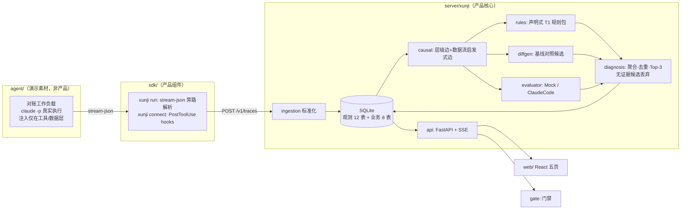

> 提交状态：已完成
> 核心交付：实施架构、技术选型、模块划分、本周不做项
> 上游依据：[提示词·范围裁定](../../promot/第三周任务提示词-优化版.md) · second-week/docs/08 · [specs/plan.md](../specs/iter03-20260827-xunji-t1/plan.md)
> 下游证据：[代码结构说明](03-代码结构说明.md) · [测试报告](04-测试报告.md)

# 任务 1：技术方案设计

## 1.1 本周实施架构

## 1.2 目标形态 → Demo 形态映射（工程原则 1）

| 目标形态（docs/08） | Demo 形态 | 升级路径 |
|---|---|---|
| ClickHouse 观测存储（tenant/project/date 分区） | SQLite 同字段同枚举 | schema.sql 注释保留分区/排序键；替换 repository 连接层 |
| Postgres 业务库 | 同一 SQLite 文件 | 建表 SQL 为 PG 兼容子集 |
| Kafka 消息队列 | 进程内直接调用（ingest 后同步触发 pipeline） | ingestion 出口抽象 enqueue |
| OTLP/HTTP protobuf | 等价字段 JSON 契约 | 网关侧加 protobuf 解码 |
| 多框架适配器（LangGraph/OpenAI Agents/Dify） | 仅 Claude Code 生态（SDK 探针 + CLI hooks/包装） | 适配器接口已隔离，逐框架新增 |
| SSE 事件推送 | FastAPI StreamingResponse 轮询库实现 | 换消息总线驱动 |

## 1.3 技术选型（候选 → 选择 → 依据 → 代价）

| 决策点 | 候选 | 选择 | 依据 | 代价 |
|---|---|---|---|---|
| 后端 | FastAPI / Flask / Express | **Python 3.11 + FastAPI 0.115** | pydantic 承载字段级契约；SSE 原生；pytest 生态 | 需 venv |
| 存储 | SQLite / DuckDB / 内存 | **SQLite（stdlib，无 ORM）** | 零服务依赖；建表 SQL 即交付物 | 性能不代表生产 |
| 前端 | Vite+React / Next.js | **Vite 6 + React 18 + TS 严格模式** | 规范强制 React+TS；Vite 代理即通后端 | 无 SSR（不需要） |
| 服务端数据 | React Query / SWR | **@tanstack/react-query 5** | 规范推荐；诊断轮询/失效重取内建 | 依赖 +1 |
| 前端测试 | Vitest+RTL+MSW | 同左（规范强制） | 用户视角测试 | — |
| 模型接入 | API Key / 本地 CLI | **claude CLI 子进程（可选）+ 启发式 Mock（默认）** | 复用本机登录态；离线零依赖 | 真实态需已登录 CLI |
| 一键命令 | Makefile / npm scripts | **根 package.json → python scripts/** | Windows 无 make | — |
| 质量工具 | ruff + pytest-cov / tsc + vitest | 同左 | 单工具多职 | — |

## 1.4 模块划分与依赖方向（单向，禁止循环）

`agent → sdk → ingestion → causal → {rules, diffgen, evaluator} → diagnosis → api → {web, gate}`

server 内部：`db/enums → ingestion → causal → rules/diffgen/evaluator → diagnosis/clustering/incidents → review/gate → api`，由 `pipeline.py` 编排（规则+Diff 同步，模型异步线程）。

## 1.5 本周不做项及理由

| 不做项 | 理由 |
|---|---|
| T2 语义增强（state/handoff/memory 采集与规则） | 范围裁定：非行业通用约定，通用流不可自动获得；表结构与注解 API 签名保留 |
| 多租户与鉴权 | 单机演示无威胁模型；字段（tenant_id）已预留 |
| LangGraph/Dify 适配 | 一个生态打穿优于三个生态半吊子；适配器接口已隔离 |
| 消息队列 / 水平扩展 | Demo 吞吐单进程足够；enqueue 抽象点已留 |
| OTel SDK 探针 | 本周采集走 stream-json/hooks；GenAI semconv 仍在演进，映射层已按其属性名对齐 |

## 1.6 实际执行偏差（诚实记录）

实施中相对本方案的偏差全部记录于 [retro-log.md](../retro-log.md)，要点：Windows 平台 claude 为 .CMD 垫片、嵌套会话终端工具名为 PowerShell、LLM 文本漂移不得进 Diff、门禁评估范围需锁口径——均为真实运行暴露，已修复并有回归测试。

---

| 检查项 | 结果 |
|---|---|
| 本任务产出 | 实施架构、选型表、模块图、不做项 |
| 核验方式 | 架构图与代码目录一一对应（见 docs/03） |
| 当前状态 | 已完成 |
| 剩余风险 | SQLite 并发写入上限未压测（Demo 范围外） |
