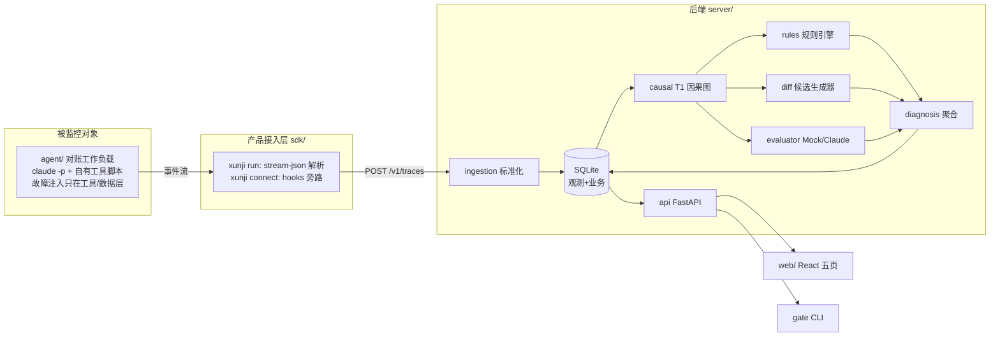

# PLAN：技术选型与实施架构（第三周）

> 提交状态：已确认
> 核心交付：选型决策、模块划分、实施顺序
> 上游依据：[spec.md](spec.md) · second-week/docs/08（目标架构，不推翻）

## 1. 本周实施架构（目标架构 → Demo 替身映射）

| 目标形态（docs/08） | Demo 形态 | 升级路径 |
|---|---|---|
| ClickHouse 观测存储 | SQLite（同字段同枚举） | 表结构注释保留分区/排序键设计；替换 repository 层 |
| Postgres 业务库 | 同一 SQLite 文件 | 建表 SQL 与 PG 兼容子集，迁移只换连接层 |
| Kafka 消息队列 | 进程内直接调用 | ingestion 后钩子处抽象出 `enqueue()`，后续替换 |
| OTLP protobuf 接收 | 契约 JSON（OTLP 兼容字段） | 网关侧加 protobuf 解码器 |
| 多框架适配器 | 仅 Claude Code（SDK+CLI） | 适配器接口已隔离，逐框架新增 |

## 2. 技术选型（候选 → 选择 → 依据 → 代价）

| 决策点 | 候选 | 选择 | 依据 | 代价 |
|---|---|---|---|---|
| 后端语言/框架 | FastAPI / Flask / Node Express | **Python 3.11 + FastAPI** | pydantic 天然承载字段级契约校验；SSE 支持好；团队 pytest 生态现成 | 需 venv 安装依赖 |
| 观测+业务存储 | SQLite / DuckDB / 内存 | **SQLite（stdlib sqlite3 + SQL 文件建表）** | 零服务端依赖；SQL 显式可评审；两库合一简化 Demo | 无真实分区/列存，性能不代表生产 |
| ORM | SQLAlchemy / 裸 sqlite3 | **裸 sqlite3 + repository 层** | 建表 SQL 即交付物（任务 2 要求字段级）；少一个重依赖 | 手写映射，靠测试兜底 |
| 前端 | Vite+React+TS / Next.js | **Vite + React 18 + TS** | 规范强制 React+TS；Vite 启动快、零配置代理 | 无 SSR（不需要） |
| 服务端数据 | React Query / SWR / 手写 | **@tanstack/react-query** | 规范推荐；轮询/失效重取内建 | 依赖 +1 |
| 前端测试 | Vitest+RTL+MSW | 同左（规范强制） | — | — |
| 模型接入 | API Key / 本地 claude CLI | **claude CLI 子进程（可选）+ 启发式 Mock（默认）** | 复用本机登录态；离线态零依赖 | 真实态需已登录 CLI |
| 一键命令 | Makefile / npm scripts / Python CLI | **根 package.json scripts → python scripts/*.py** | Windows 无 make；npm 已就绪；脚本跨平台 | — |
| 后端质量 | ruff + pytest + coverage | 同左 | 单工具承担 lint+format | — |

## 3. 模块依赖（单向）

`agent → sdk → server.ingestion → server.causal → {server.rules, server.diff, server.evaluator} → server.diagnosis → server.api → {web, gate}`

server 内部包结构：`server/xunji/{db,ingestion,causal,rules,diffgen,evaluator,diagnosis,clustering,review,regression,gate,api}`。

## 4. 实施顺序（端到端优先）

1. 脚手架 + 建表 SQL + ingestion（含契约校验与降级）→ 可导入 Trace；
2. causal → rules → diffgen → evaluator(Mock) → diagnosis → 可对失败 Trace 出候选；
3. incidents/clustering + review + regression + gate API → 后端闭环可用（API 级）；
4. sdk（stream-json 解析 + xunji run/connect）+ agent 工作负载 + 注入 → 真实态数据链路通；
5. 录制 fixtures（真实运行）→ 离线态 + E2E 冒烟；
6. web 五页 → 前端闭环；
7. ClaudeCodeEvaluator + SSE 增量 → 演示增强；
8. 文档 + DEMO.md + 复盘。

每步完成即按模块提交（Conventional Commits + AI trailer）。

## 5. 风险与对策

| 风险 | 对策 |
|---|---|
| 嵌套调用 `claude -p` 在本会话内受限 | 录制脚本独立于会话可手跑；受限则如实记 retro-log，fixtures 标注录制环境 |
| stream-json 事件格式与预期不符 | sdk 解析器对未知事件宽容跳过 + 原始流存档，解析问题记 retro-log |
| 前端体量超预算 | 五页保底，Diff 视图允许降级为字段表格（提示词已授权） |
| 数据流启发式误报 | 边带 confidence，聚合层降权；误报案例记 retro-log 供复盘 |
