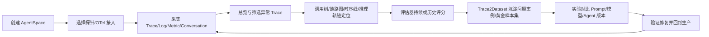
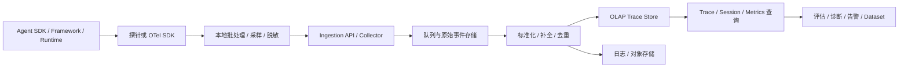
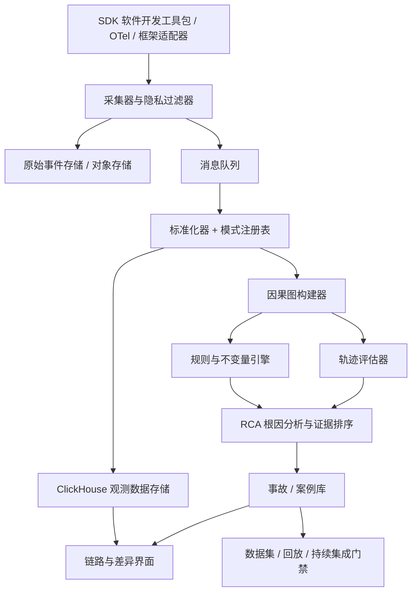

# Agent 链路追踪竞品对比与 AgentLoop 深度分析

> 检索截止日期：2026-08-12（Asia/Shanghai）  
> 对比对象：阿里云 AgentLoop、华为云智果 AgentArts、Langfuse  
> 深度分析对象：阿里云 AgentLoop（除全景对比外，后续章节均聚焦该产品）  
> 证据口径：优先采用官网、官方文档、官方 GitHub、路线图和更新日志  
> 标签说明：**[事实]** 可由来源直接证明；**[推断·高/中/低]** 基于公开证据推演；**[建议]** 本报告给出的产品判断
> 术语说明：专业英文名词在首次出现时附中文释义，后续沿用英文或缩写。

## 目录

1. [三款竞品全景对比](#1-三款竞品全景对比)
2. [AgentLoop 核心流程拆解](#2-agentloop-核心流程拆解)
3. [AgentLoop 高价值候选场景与评分](#3-agentloop-高价值候选场景与评分)
4. [AgentLoop 优先场景选定与论证](#4-agentloop-优先场景选定与论证)
5. [AgentLoop 设计逻辑与商业模式](#5-agentloop-设计逻辑与商业模式)
6. [AgentLoop 技术选型与架构侦察](#6-agentloop-技术选型与架构侦察)
7. [AgentLoop AI 能力拆解](#7-agentloop-ai-能力拆解)
8. [AgentLoop 用户旅程深挖](#8-agentloop-用户旅程深挖)
9. [AgentLoop 缺陷与改进方案](#9-agentloop-缺陷与改进方案)
10. [基于 AgentLoop 的差异化方向](#10-基于-agentloop-的差异化方向)
11. [技术可行性与 MVP 路线](#11-技术可行性与-mvp-路线)
12. [AgentLoop 未来半年战略预判](#12-agentloop-未来半年战略预判)

---

## 1. 三款竞品全景对比

> 常用术语：Agent（智能体）、Trace（链路追踪记录）、Span（链路片段）、Token（词元）、OTel（OpenTelemetry，开放遥测）。

### 1.1 核心能力对比

| 维度 | AgentLoop | AgentArts | Langfuse |
|---|---|---|---|
| 核心定位 | Agent 观测、审计、评估、实验、资产与自进化 | Agent 开发、运行、资产、观测、评估全栈 | 开源 AI 工程与质量改进平台 |
| 目标用户 | 企业 AI 平台、Agent Owner（智能体负责人）、SRE（站点可靠性工程师）、安全团队 | 企业业务开发、专业开发、平台与运维 | 开发者、AI/ML（人工智能/机器学习）工程、产品与平台团队 |
| Trace（链路追踪记录） | 调用树、链路图、时序线、推理轨迹、链路分析 | Root/All Span、调用链、会话、日志/指标 | Trace Tree、Log View、Agent Graph、Observation 查询 |
| Agent 语义 | Trajectory（执行轨迹）为核心；Agent、LLM（大语言模型）、Tool（工具）、RAG（检索增强生成）、Memory（记忆）等 | Trace/Span；原生单 Agent、工作流、多 Agent | Observation（观测事件）/Trace/Session（会话）；Agent/Tool/Retriever（检索器）等类型 |
| 调试 | 精细 Span（链路片段）详情、输入输出、参数、耗时、Token（词元）、拓扑联动 | 节点耗时与状态、会话上下文、运行日志 | 全文检索、Trace/Graph/Log、Prompt（提示词）到 Playground（调试工作台） |
| 评估 | Agent-as-a-Judge（智能体评审）、LLM-as-a-Judge（大模型评审）、人工；Trace/Log/Dataset（数据集）；持续/历史 | 模型判定、代码判定、自适应判定；单/多轮；任务对比 | LLM-as-a-Judge、Code Evaluator（代码评估器）、人工标注、外部流水线；Observation/Experiment（实验） |
| 实验与数据集 | Trace2Dataset（链路转数据集）、Golden Set（黄金样本集）/Bad Case（问题案例）、Pipeline（处理流水线）、在线/离线实验 | 评测集、在线/离线评估、最多 5 个任务对比 | Dataset、Experiment、CI/CD（持续集成/持续交付）、Prompt/模型对比 |
| 监控/告警 | Trace/Token/模型/工具/RAG/健康度；可联动云监控 | 业务与运营指标；底层 AOM/APM/LTS | 自定义 Dashboard、Metrics API、cost/quality/latency monitors |
| 成本分析 | Token 分布和热点；云资源与按量项并存 | Token、调用与 CU；底层云服务另计 | 模型 token/cost 归集、Metrics API、自定义模型价格 |
| 安全审计 | 明显优势：应用行为 + eBPF（扩展伯克利包过滤器）Runtime（运行时）、风险检测、证据调查 | 沙箱、IAM（身份与访问管理）、日志/调用链；观测侧审计能力公开证据较少 | 数据遮罩、RBAC（基于角色的访问控制）/SSO（单点登录）、审计日志；不以运行时行为审计为核心 |
| 协作 | AgentSpace（智能体空间）、RAM（访问控制）、资产版本/审计 | 成员/空间/IAM、资产广场、版本 Diff（差异对比） | 无限用户（付费方案）、Annotation Queue（标注队列）、Comments（评论）、共享视图 |
| 接入 | 阿里云探针、开源探针、OTel；多框架/CLI（命令行界面）；部分零侵入 | 原生自动、高代码托管、第三方 OTel OpenAPI（开放应用程序接口） | Python/JS SDK（软件开发工具包）、OTel、50+ 集成、LiteLLM/API（应用程序编程接口） |
| 部署 | 阿里云托管；公开资料未发现独立私有化交付说明 | 华为云托管；公开资料未发现开源自托管 | Cloud、Docker Compose、Kubernetes、AWS/Azure/GCP，自托管成熟 |
| 开放性 | OTel 接入，但产品闭源且深度依赖阿里云 | OTel 接入，但产品闭源且依赖华为云 | 核心开源，MIT（`ee` 例外），API/SDK 完整 |
| 接入成本 | 中—高：需 AgentSpace，关联 CMS/MSE/SLS，配置探针与权限 | 原生应用低；第三方中；需开通 AOM/APM/LTS 与 IAM | 低—中：Cloud 快；生产自托管运维复杂度高 |
| 当前商业化 | 按 AI 积分、数据集存储、执行次数，ARMS/SLS 等另计 | 体验版 + CU/套餐；多档付费版尚未开放，底层资源另计 | 免费层 + Core/Pro/Enterprise + 用量；自托管与企业支持 |

### 1.2 谁在哪方面领先

- **AgentLoop：** 生产 Trace 到评估、数据集、实验、经验库和安全审计的闭环最完整，尤其适合已在阿里云上的企业。
- **AgentArts：** 开发、运行时、MCP 网关、记忆、沙箱、办公入口和运维一体化最强，适合希望“一站式搭建并托管”的华为云客户。
- **Langfuse：** 开放性、自托管、开发者生态、数据平台透明度和跨框架接入最强；路线图也最公开。

### 1.3 适用边界

- 只想为已有异构 Agent 增加中立观测：优先 Langfuse。
- 已在阿里云且希望把观测、审计、评估、数据资产做成闭环：优先 AgentLoop。
- 想从低代码搭建到企业运行时一站式落地：优先 AgentArts。
- 需要跨云、跨组织、跨框架的“语义根因分析”：三家都能提供数据底座，但公开能力尚未形成压倒性答案。

---

## 2. AgentLoop 核心流程拆解

### 2.1 选择的核心任务

选择“**把一次生产 Bad Case（问题案例）从 Trace 定位到可回归验证的修复**”，因为它最能体现 AgentLoop 不只是监控，而是数据飞轮。

### 2.2 端到端流程



### 2.3 步骤级拆解

| 步骤          | 用户目标       | 用户操作                                        | 系统反馈 / 数据对象                                       | 设计意图                 | 阻力与改进机会                                      |
| ----------- | ---------- | ------------------------------------------- | ------------------------------------------------- | -------------------- | -------------------------------------------- |
| 1. 创建空间     | 建立团队/业务隔离  | 选择地域，创建 AgentSpace，关联 CMS 2.0、MSE、SLS       | AgentSpace 与多个云资源一一绑定                             | 用阿里云资源边界承载权限、数据和资产   | 前置服务多、失败不回滚；应增加依赖检查、成本预估和一键修复                |
| 2. 接入 Agent | 让生产执行可见    | 选框架；安装 `aliyun-bootstrap` 或用 OTel；配置环境参数启动  | 自动采集 LLM、Tool、Retriever、LangGraph 节点              | 降低业务代码改造，扩大框架覆盖      | 框架插件与裸 SDK 可重复采集；应自动检测重复 Span                |
| 3. 验证采集     | 确认没有漏数     | 查看 Trace 数、耗时、Token 趋势与最新记录                 | Trace、Span、模型输入输出、工具参数                            | 快速建立“有数据”的正反馈        | 缺少采集完整度评分；建议提供字段覆盖、断链和敏感数据体检                 |
| 4. 发现异常     | 从海量执行里找目标  | 按 Agent/用户/会话/耗时/Token/错误筛选或聚合              | Trace 列表、趋势图、健康事件                                 | 先粗筛，再下钻              | 仍依赖用户知道查什么；机会是主动聚类失败模式与优先级排序                 |
| 5. 定位问题     | 判断具体哪一步错   | 切换调用树、链路图、时序线、推理轨迹；检查 Span                  | ENTRY/AGENT/LLM/TOOL、输入输出、Attributes、Events、Links | 同时满足结构、时序、语义与性能排障    | 视图丰富但认知切换多；缺少“第一故障点 + 因果证据”统一答案              |
| 6. 量化质量     | 判断是偶发还是系统性 | 选择预置/自定义 Agent Judge，映射变量，设置采样              | Score、Reason、可选评估轨迹；持续或历史任务                       | 把主观 Bad Case 变成可追踪指标 | 单次 Trace 评估不等于多轮会话因果；截至文档，多轮 Session 评估仍在计划中 |
| 7. 沉淀样本     | 让问题可复用     | 从 Trace 处理生成 Dataset，人工标注并拆分 BadCase/Golden | 数据集、Schema、版本、Pipeline、标注                         | 数据一次采集，多场景复用         | 字段映射和样本质量仍需要专家；可用 AI 辅助但必须保留审阅               |
| 8. 验证修复     | 证明新版本真的更好  | 以数据集运行 Agent/LLM 实验，对比 Prompt、模型、参数、工具      | 质量、延迟、Token、成本和显著性结果                              | 形成上线前质量门禁            | 从诊断到修复配置仍较多跳转；建议一键创建对照实验并保留变更血缘              |

事实来源：[AgentLoop QuickStart](https://www.alibabacloud.com/help/zh/agentloop/latest/agentloop-quickstart-whole-process-practice)；[链路追踪](https://help.aliyun.com/zh/document_detail/3042591.html)；[核心概念](https://help.aliyun.com/zh/document_detail/3042001.html)

### 2.4 信息架构

```text
AgentSpace
├─ 接入中心：框架探针 / OTel / 应用监控
├─ AI Agent 可观测
│  ├─ 总览与 Agent 列表
│  ├─ 链路追踪 / 会话分析
│  ├─ 模型 / 工具 / RAG 分析
│  └─ 日志 / 指标 / 告警联动
├─ 审计：事实 → 风险 → 实体调查 → 回放
├─ 评估：评估器 → 任务 → 结果
├─ 实验：模型 / Agent / Prompt 对比
├─ 数据中心：Trace → Pipeline → Dataset → 标注
├─ Agent 资产与上下文：Prompt / Skill / Memory / Experience
└─ 系统管理：空间 / 服务 / RAM / 资源绑定
```

**[推断·高]** 该架构围绕“数据飞轮”而非单个页面组织：Trace 是原料，Trajectory 是可理解的过程，Dataset/Experience 是资产，Evaluation/Experiment 是验证机制，Prompt/Skill/Memory 是可被改动的对象。这也是 AgentLoop 与传统 APM 的核心设计差异。

---

## 3. AgentLoop 高价值候选场景与评分

### 3.1 评分公式

`总分 = 痛点强度×25% + 使用频率×15% + 用户覆盖×15% + 付费意愿×15% + 相对 AgentLoop 空白×15% + 技术可行性×15%`

每项 1–5 分，总分上限 5。

| 排名 | 候选场景 | 痛点 | 频率 | 覆盖 | 付费 | 空白 | 可行性 | 加权总分 |
|---:|---|---:|---:|---:|---:|---:|---:|---:|
| 1 | 跨 Agent 因果故障定位与证据化回放 | 5 | 4 | 4 | 5 | 5 | 4 | **4.55** |
| 2 | 生产质量回归预警与发布门禁 | 5 | 5 | 5 | 4 | 3 | 4 | **4.40** |
| 3 | Token / 延迟异常归因与成本优化 | 4 | 5 | 5 | 4 | 2 | 5 | **4.15** |
| 4 | RAG 上下文、记忆与答案血缘追踪 | 4 | 4 | 4 | 4 | 4 | 4 | **4.00** |
| 5 | 高风险 Agent 行为审计与合规回放 | 5 | 3 | 3 | 5 | 3 | 4 | **3.95** |

### 3.2 逐项依据

#### 场景 1：跨 Agent 因果故障定位与证据化回放

- **用户与问题：** AI 平台、Agent Owner、SRE 面对多 Agent、多工具和长任务，能看到大量 Span，却难判断首个语义故障点。
- **现状不足：** 当前工具主要按时间与父子关系展示；“状态为何被污染、交接契约为何失效、工具为何选错”仍需人工判断。
- **价值：** 缩短 MTTR，避免同类问题复发，并为质量、审计和复盘提供统一证据。
- **评分依据：** 痛点与付费意愿高；AgentLoop 已具备数据底座但尚未公开成熟的因果诊断答案；技术上可利用 OTel 与现有模型，不过可靠诊断需要领域数据。
- **关键指标：** 首故障点 Top-3 命中率、证据接受率、MTTR 降幅、同类问题复发率。

#### 场景 2：生产质量回归预警与发布门禁

- **用户与问题：** 每次改 Prompt、模型、工具或知识库，都可能让另一类任务退化。
- **AgentLoop 现状：** 已有评估、数据集与实验，但从线上问题到回归集、CI 门禁仍存在配置和字段映射成本。
- **价值：** 在用户投诉前发现退化，降低变更风险。
- **评分依据：** 高频、覆盖广；但 AgentLoop 已具备持续评估、数据集和实验能力，因此相对它的功能空白只有 3。
- **关键指标：** 线上回归提前发现率、发布阻断准确率、误报率、从 Bad Case 到用例的时间。

#### 场景 3：Token / 延迟异常归因与成本优化

- **用户与问题：** 运营和平台团队难解释成本突增来自哪个 Agent、工具、重试或上下文。
- **AgentLoop 现状：** 已具备 Token/耗时分解，缺口主要在自动归因并给出可验证的优化动作。
- **价值：** 直接对应云账单和单位成功任务成本。
- **评分依据：** 高频、可量化、易实现，但差异化弱。
- **关键指标：** 单成功任务成本、无效重试率、P95 延迟、优化建议采纳率。

#### 场景 4：RAG 上下文、记忆与答案血缘追踪

- **用户与问题：** 答案错时难判断是召回、排序、旧记忆、提示拼装还是生成问题。
- **现状不足：** 多数产品能看 Retriever Span，却未把“文档版本—片段—记忆—最终断言”做成稳定血缘。
- **价值：** 提高回答可解释性和知识修复效率。
- **评分依据：** 差异化较好，可借助结构化引用与版本数据实现。
- **关键指标：** 错误断言溯源成功率、上下文污染检出率、修复后准确率。

#### 场景 5：高风险 Agent 行为审计与合规回放

- **用户与问题：** 金融、政务、研发终端等场景需要知道 Agent 访问了什么、发出了什么命令、是否越权。
- **现状不足：** AgentLoop 已有强审计与 eBPF 采集，安全厂商和云厂商也容易进入。
- **价值：** 预算明确、合规刚需强，但目标行业较窄、销售周期长。
- **关键指标：** 高风险行为检出率、误报率、证据完整度、调查时间。

---

## 4. AgentLoop 优先场景选定与论证

### 4.1 选定场景

**跨 Agent 因果故障定位与证据化回放。**

### 4.2 用户痛点

- 多 Agent 系统的失败常由上游状态、记忆、交接内容或工具结果逐步放大，最后报错节点未必是根因。
- 长链路里同时存在技术异常和“结果看起来正常但业务上错了”的语义异常。
- 修复后缺少相同输入、相同上下文和相同依赖条件，难证明问题真的解决。

### 4.3 AgentLoop 能力缺口

- AgentLoop 有五种 Trace 视图、STAROps 与 Agent-as-a-Judge，但公开文档更强调性能/Token 热点、人工下钻和轨迹评估。
- 目前未见成熟的跨 Agent 因果故障定位工作台，也未见把“首故障点—证据—反证—验证动作”组织成统一排障流程的公开证据。
- 因此机会不在替代 AgentLoop 的 Trace 底座，而在其现有观测与评估数据之上补齐高可信诊断层。

### 4.4 商业价值

- 购买者不是单个开发者，而是承担生产稳定性的 AI 平台负责人、应用 Owner、SRE 与合规团队。
- 可量化价值包括排障工时、事故影响时间、低质输出数量、重复失败和工程师值班成本。
- 可采用“基础可观测低门槛 + 因果诊断/回放/治理企业付费”的分层模式。

### 4.5 技术可行性

**[推断·中高] 可行，但必须分层。** W3C Trace Context（W3C 链路上下文标准）能保证跨服务 `traceparent` 传播；OTel GenAI（开放遥测生成式 AI）语义约定已覆盖模型、Token、输入输出和 Agent 属性，但 Agent 任务、记忆、交接等标准仍在演进。[W3C Trace Context](https://www.w3.org/TR/trace-context/)；[OpenTelemetry GenAI](https://opentelemetry.io/blog/2026/genai-observability/)

可行路径：

1. 用标准 Trace/Span 做底座；
2. 用扩展事件补齐 task（任务）、handoff（交接）、state diff（状态差异）、memory read/write（记忆读写）、artifact lineage（制品血缘）；
3. 先用规则/不变量确定“确定性故障”，再用轨迹评估模型处理语义问题；
4. 诊断结果必须引用具体事件和字段，并允许人工确认/驳回；
5. 经确认的案例进入故障模式库和回归集。

### 4.6 为什么是现在

- AgentLoop 已把 Trace、Trajectory、Judge、Dataset、Experiment 和 Experience 串成优化闭环，说明用户需求已从“能看 Trace”升级到“能解释并改进 Trace”。
- OTel、W3C Trace Context 提供跨框架基础，减少从零定义采集协议的成本。
- AgentLoop 迭代速度快，因果诊断的差异化窗口存在，但不会长期开放。

### 4.7 反方观点与回应

| 反方观点 | 合理之处 | 回应 |
|---|---|---|
| Agent 标准仍在变化，现在做会反复改数据模型 | OTel Agent 语义仍演进，不同框架事件不一致 | 以不可变原始事件 + 可版本化语义层设计；标准字段稳定存储，扩展字段通过 Schema Registry（模式注册表）演进 |
| AI 根因分析会幻觉，生产团队不会信 | 单靠 LLM 总结确实不可靠 | 混合规则、因果约束与模型；结论必须带证据、置信度和反证；先做“辅助定位”，不做自动修复 |
| AgentLoop 很快可以补齐 | 它已有数据、云生态和分发优势 | 护城河放在跨框架故障本体、经过确认的案例库、诊断评测集和工作流嵌入，而不是 Trace UI |

---

## 5. AgentLoop 设计逻辑与商业模式

### 5.1 AgentLoop 为什么这样设计

1. **以 AgentSpace 为顶层。** 企业客户首先需要地域、团队、权限与资源隔离；代价是上手重。
2. **先总览/筛选，再五视图下钻。** 列表、树、拓扑、时序和对话分别回答“哪条异常、结构怎样、依赖怎样、哪里慢、说了什么”。
3. **把 Trajectory 设为核心对象。** 单次 LLM 输出无法解释多步任务；完整轨迹可同时服务观测、评估、审计和经验挖掘。
4. **把 Trace 接到 Dataset、Experiment、Asset。** 这样监控不是终点，Bad Case 可以成为评测资产，资产变更又能触发验证。
5. **深度绑定云产品。** CMS/ARMS 负责可观测，SLS 负责日志/审计/结果，MSE 承载 Prompt/Skill；能复用成熟基础设施，也形成云消费和迁移成本。

### 5.2 新手与专家设计

| 用户 | 服务它的设计 | 代价 |
|---|---|---|
| 新手 | 自动探针、预置评估器、QuickStart、默认图表、Playground | 仍需理解多个阿里云产品与权限 |
| 专家 | 搜索表达式、OTel 属性、五种 Trace 视图、自定义 Judge、Skill/MCP、SLS SQL | 功能分散，跨模块上下文切换大 |

### 5.3 商业模式

- **[事实]** AgentLoop 按 AI 积分、数据集存储和执行次数收费：AI 积分 0.01 元/积分，数据集存储 0.00004 元/条/天，执行 0.001 元/次；新用户首月有免费额度。观测依赖 ARMS，审计/评估结果依赖 SLS，关联服务分别计费。[计费说明](https://help.aliyun.com/zh/document_detail/3044490.html)
- **[推断·高]** 其商业逻辑是按分析、执行和存储用量收费，同时拉动阿里云可观测、日志、微服务和模型消费。
- **用户影响：** 单项费率透明，但完整 TCO（总体拥有成本）分散在 AgentLoop、ARMS、SLS、MSE 等多个账单项；采购前需要按 Agent Run（智能体运行次数）、Trace 保留期、Judge 调用量和日志量做联合估算。
- **产品含义：** AgentLoop 的商业壁垒不仅是功能，还包括与阿里云资源、权限和账单体系形成的一体化迁移成本。

### 5.4 可复制与不可复制

- 可复制：按有效 Agent Run/诊断用量计费、免费额度、预置评估器、数据集实验闭环。
- 不宜照抄：AgentLoop 的跨服务拆分计费；早期产品若照搬会让客户难预测成本。
- **[建议]** 我们可以按“每月有效 Agent Run + 诊断次数”计费，并把基础存储、脱敏和核心查询打包，避免把正常调试拆成多项隐性费用。

---

## 6. AgentLoop 技术选型与架构侦察

### 6.1 AgentLoop 技术证据边界

| 证据层级 | 可确认内容 | 判断 |
|---|---|---|
| 已证实 | ARMS/自研或开源探针与 OTel；CMS 2.0 工作空间；SLS 日志与 Scheduled SQL；MSE Prompt/Skill；RAM；Trace 使用 OTel/GenAI 属性 | AgentLoop 是编排多个阿里云底座的上层 Agent 观测与优化产品 |
| 高置信推断 | 采集端采用异步批量上报；服务端进行多租户 Trace 分析，并把 Trace/Log 通过 Pipeline 转成 Trajectory、Dataset 等对象 | 与官方接入方式、数据处理流程和云服务分工一致，但具体实现未开源 |
| 尚未确认 | 前端框架、具体时序/图数据库、队列、索引结构、私有化交付架构、真实客户 P50/P95 | 不应把通用云架构经验写成 AgentLoop 已证实事实 |

### 6.2 AgentLoop 核心数据模型

| 层级 | AgentLoop 对象 | 在闭环中的作用 |
|---|---|---|
| 空间与权限 | AgentSpace、RAM、关联 CMS/MSE/SLS 资源 | 隔离团队、地域、权限、资产与账单 |
| 会话 | Conversation / Session | 聚合跨轮交互；当前公开查询与评估能力仍有补齐空间 |
| 单次任务 | Trace / Trajectory | Trace 表达调用链，Trajectory 表达可评估的完整执行过程 |
| 原子步骤 | Span：ENTRY/AGENT/LLM/TOOL/RAG/Memory 等 | 承载输入输出、耗时、Token、属性、事件和链接 |
| 质量对象 | Evaluator、Score、Reason、评估轨迹 | 把主观 Bad Case 转为可统计、可追踪的质量信号 |
| 优化资产 | Dataset、Prompt、Skill、Memory、Experience、Experiment | 把线上问题沉淀为样本、资产变更和验证任务 |

### 6.3 AgentLoop 采集与查询链路



- **已证实链路：** 探针或 OTel → ARMS/CMS 观测；SLS 承载日志、审计和评估结果；Pipeline 将 Trace/Log 处理为 Trajectory/Dataset。
- **产品层含义：** AgentLoop 自身更像统一语义、交互和优化工作流层，底层采集、指标、日志与资产分别复用阿里云现有服务。
- **风险：** 多服务协同增加权限、资源绑定、账单解释和故障边界识别的复杂度。

### 6.4 大规模 Trace 的合理实现推断

以下是依据公开接入方式和通用可观测架构做出的实现推断，不代表 AgentLoop 官方披露：

1. 客户端异步批量、短任务显式 flush；
2. 原始事件先落对象存储，队列削峰，失败可重放；
3. 采用面向高写入与聚合查询的分析型存储；
4. Trace 列表虚拟滚动、按需加载大字段、图视图聚合重复节点；
5. 大字段与多模态存对象存储，索引只保留摘要与引用；
6. Head/Tail Sampling、错误/高成本/低质量事件优先保留；
7. 租户、项目、时间作为分区或排序关键维度；
8. PII 在采集端优先脱敏，服务端再做策略兜底。

### 6.5 AgentLoop 性能判断

- 官方描述支持企业高并发/高可用，并提供聚合 Trace 与多视图下钻。
- 未找到 AgentLoop 公开的独立压测、真实客户数据规模、写入吞吐或查询 P50/P95。
- 因此当前只能确认产品目标和功能形态，不能确认其在超长 Trace、高基数属性、多模态大字段和跨地域查询下的实际表现。
- 下一轮应以同一 Agent 样本实测接入损耗、丢/重 Span、长链加载时间、筛选响应和成本，而不是引用其他产品的性能数字代替 AgentLoop 证据。

---

## 7. AgentLoop AI 能力拆解

| 能力 | AgentLoop 当前能力 | 证据状态 | 局限与机会 |
|---|---|---|---|
| 大模型评估 | Agent-as-a-Judge / LLM-as-a-Judge；输出 Score、Reason，并可保留评估轨迹 | 官方评估器与评估任务文档可证实 | “会打分”不等于能定位根因；需增加校准集、人机一致率与置信边界 |
| Agent 轨迹评估 | 读取完整 Trajectory，评估工具选择、步骤效率和任务完成度 | 官方核心概念与 Judge 文档可证实 | 对跨轮状态污染、错误交接和间接因果的覆盖仍需实测 |
| 自动诊断 | STAROps 定位性能与 Token 热点；评估器识别 Bad Case | 官方链路分析与评估文档可证实 | 公开能力仍偏热点识别和结果评分，缺少统一的首故障点与因果证据工作台 |
| RAG / Memory | Trace 记录检索与记忆步骤；Judge 可评估 RAG；Experience 支持经验挖掘和召回 | 官方 Trace、核心概念与经验库文档可证实 | 检索统计不等于答案血缘；需连接文档版本、片段、记忆、最终断言与修复结果 |
| 数据沉淀 | Trace2Dataset、Pipeline、Golden/BadCase、经验挖掘 | 官方数据集、实验和经验库文档可证实 | 字段映射、样本质量和人工审核仍是闭环成本 |
| Prompt/资产优化 | Playground、Experiment、Prompt/Skill/Memory 等资产 | 官方实验与资产文档可证实 | 诊断到创建对照实验之间仍可减少跳转并强化变更血缘 |
| 自然语言查询 | 未发现面向通用观测数据的 NL 查询公开证据 | 证据不足 | 可作为效率增强项，但优先级低于高可信因果诊断 |
| 规则/工具验证 | Judge 可通过 Skill/MCP 扩展外部验证 | 官方评估器文档可证实 | 应让确定性规则先处理格式、数值、权限和状态机不变量，再由模型处理语义 |

### 7.1 效果与局限

- Agent Judge 可绑定 Skill/MCP 做外部验证，设计上优于只看最终文本。
- AgentLoop 官方未公开独立准确率、误报率、人与模型一致性或不同 Judge 成本的统一基准。
- 实际效果会受到变量映射、Rubric、模型选择、轨迹完整度和业务定义影响，因此不能用单次 Demo 分数替代生产校准。
- 在实测前，应把 AI 输出定位为“候选诊断”，而不是自动定责或自动修复结论。

### 7.2 基于 AgentLoop 缺口的改进原则

1. 确定性问题优先用规则、Schema、状态机不变量和执行结果验证；
2. 模型只处理语义和候选因果关系，不让它“凭感觉定案”；
3. 每条诊断引用 Span ID、状态 Diff、工具参数、Artifact 版本和相关成功基线；
4. 输出支持、反对证据以及置信度；
5. 用用户确认/驳回持续校准故障分类器；
6. 以“诊断正确率、证据接受率、MTTR”评估产品，不以总结文本流畅度评估。

---

## 8. AgentLoop 用户旅程深挖

以下旅程以 AgentLoop 用户完成“生产 Bad Case 定位—修复—回归”为主线，判断其从接入到复发预防的完整体验。

| 阶段 | 触发 | 用户动作 | AgentLoop 当前体验 | 情绪 | 关键问题 | 改进机会 |
|---|---|---|---|---|---|---|
| 1. 接入 | Agent 即将上线或刚出事故 | 选 SDK/OTel、配置 Key、确认数据 | 框架多、字段不一、敏感内容担忧 | 谨慎 | 是否漏 Span、是否重复、是否泄密 | 接入体检：覆盖率、断链、重复、敏感字段、成本预估 |
| 2. 发现 | 告警、客诉、低分或成本异常 | 从总览筛选问题范围 | 指标多但不知道从哪看 | 焦虑 | 哪类失败最重要、影响多少用户 | 自动聚类失败模式，按影响范围与置信度排序 |
| 3. 定位 | 找到异常 Trace | 翻树、时序、对话、参数、日志 | 信息完整但长链路认知负担高 | 挫败 | 最后报错点是否真是根因 | 标出“首故障点”，展示因果路径与反证 |
| 4. 协作 | 需要开发、产品、业务共同判断 | 分享链接、截图、复制输入输出 | 上下文散落，责任边界争议 | 拉扯 | 谁负责、证据是否一致 | 可脱敏事件包、评论、责任域、诊断状态与审计记录 |
| 5. 修复 | 修改 Prompt/工具/记忆/代码 | 创建分支或新版本 | 难保证只改变一个变量 | 希望 | 修复会不会伤到别的场景 | 从故障直接生成对照实验和建议验证集 |
| 6. 验证 | 准备重新上线 | 重放、对比、回归 | 环境、依赖和上下文难复现 | 不安 | 是否真的修好、是否引入回归 | 脱敏快照回放、成功链 Diff、发布门禁 |
| 7. 学习 | 同类问题再次出现 | 搜旧工单/旧 Trace | 经验沉在个人和聊天记录 | 疲惫 | 为什么重复踩坑 | 故障模式库、可复用不变量与回归样本 |

### 8.1 关键旅程原则

- 默认先给“结论候选 + 证据”，再允许下钻全部 Trace；
- 技术视图与业务视图共享同一个事件，不维护两套真相；
- 所有 AI 建议都能追溯、否决和重新验证；
- 从“发现”到“生成回归用例”不超过三次主操作。

---

## 9. AgentLoop 缺陷与改进方案

| # | AgentLoop 问题表现与证据 | 影响用户 | 根因推测 | 改进方案 | 验证指标 |
|---:|---|---|---|---|---|
| 1 | QuickStart 需 AgentLoop、CMS 2.0、SLS、MSE、RAM、AccessKey；多资源绑定失败时已建资源不回滚 | 首次接入团队 | 复用成熟云产品导致依赖链长 | 一键依赖体检、事务化创建/回滚、费用预估、最小模式 | 首条 Trace 时间、创建失败率、遗留资源数 |
| 2 | 文档说明暂无独立会话查询 SDK，会话数据需 SLS SQL；截至文档，评估仍有单次 Trace 边界 | 需要多轮分析的平台团队 | 能力按模块演进，Session 尚未成为完整一等对象 | Session API、跨轮状态 Diff、多轮 Judge 与会话级回归 | 会话诊断覆盖率、SQL 手工操作下降、跨轮问题命中率 |
| 3 | 五种 Trace 详情视图信息丰富，但用户需在树、图、时序、推理轨迹与分析之间切换 | 开发与 SRE | 技术数据按展示方式组织，而非按故障假设组织 | 统一“诊断工作台”：症状→候选根因→证据→验证动作 | 平均视图切换数、定位时间、诊断采纳率 |
| 4 | 框架插件与裸 SDK 可能重复采集，复杂异步链路也可能出现断链 | 多框架接入团队 | 多种自动/手工接入方式并存，跨进程上下文传播不一致 | 自动识别重复 Span、断链提示、采集完整度评分与修复向导 | 重复率、断链率、接入工单量 |
| 5 | Judge 可做轨迹评估，但没有公开独立准确率、误报率和人机一致性基准 | 质量负责人 | 评估质量依赖 Rubric、模型、数据和业务定义 | 每个 Evaluator 配校准集、一致性区间、漂移监控和人工复核阈值 | 人机一致率、误报/漏报、跨版本稳定性 |
| 6 | AgentLoop、ARMS、SLS、MSE 等关联服务分项计费，完整 TCO 需要跨账单估算 | 采购、财务与平台负责人 | 产品复用多个云底座，成本口径按服务拆分 | Agent Run 级成本归集、总成本计算器、预算告警与保留期模拟 | 预算偏差、报价周期、单位成功任务成本 |
| 7 | Trace→评估→Dataset→Experiment 闭环完整，但跨模块操作和字段映射仍需人工 | Agent Owner 与评测团队 | 各模块资产边界清晰，但事故上下文没有贯穿为一等对象 | 从事故一键生成评估任务、数据集样本和对照实验，保留变更血缘 | 闭环操作数、Bad Case 转用例时间、回归复用率 |

事实来源：[AgentLoop QuickStart](https://www.alibabacloud.com/help/zh/agentloop/latest/agentloop-quickstart-whole-process-practice)；[AgentLoop FAQ](https://help.aliyun.com/zh/document_detail/3042703.html)；[链路追踪](https://help.aliyun.com/zh/document_detail/3042591.html)；[评估器](https://help.aliyun.com/zh/document_detail/3042180.html)；[计费说明](https://help.aliyun.com/zh/document_detail/3044490.html)

---

## 10. 基于 AgentLoop 的差异化方向

### 10.1 候选方向

| 方向 | 用户价值 | 差异程度 | 可行性 | 防御性 | 总分 /20 | 角色 |
|---|---:|---:|---:|---:|---:|---|
| A. Causal-first Debugger（因果优先调试器）：跨 Agent 因果诊断 | 5 | 5 | 4 | 4 | **18** | **主方向** |
| B. Compliance Replay（合规回放）：可验证行为证据与回放 | 5 | 3 | 4 | 4 | **16** | **备选方向** |
| C. Success-unit FinOps（按成功任务计量的成本运营）：按成功任务优化成本 | 4 | 2 | 5 | 3 | **14** | 配套能力 |

### 10.2 主方向：Causal-first Debugger（因果优先调试器）

- **用户痛点：** Trace 很长，错误节点不等于根因节点。
- **AgentLoop 不足：** 当前主要提供结构、时序、热点与轨迹评估；主动语义根因仍处发展中。
- **产品主张：** “不只是告诉你发生了什么，而是给出最早的故障因、完整证据和验证办法。”
- **可感知差异：** 打开事故即看到 3 个候选根因、影响路径、证据、反证、与成功执行的 Diff。
- **壁垒：** Agent 故障本体、跨框架语义映射、经人工确认的因果案例库、诊断评测集。
- **复制风险：** 中高。AgentLoop 已有数据与分发优势，可继续补齐诊断功能；需要通过跨云中立、诊断质量和工作流速度建立领先。
- **验证方式：** 用 30–50 条已知根因的真实/脱敏事故，测试 Top-1/Top-3 命中、证据接受率和定位时间。

### 10.3 备选方向：Compliance Replay（合规回放）

- **用户痛点：** 高风险 Agent 的文件、Shell、API、网络行为需要完整留痕和可复核。
- **差异点：** 把“运行时事实 + 应用语义 + 权限决策 + 业务影响”放在同一证据包，而非仅列系统调用。
- **壁垒：** 数据覆盖、不可篡改证据、行业规则和调查工作流。
- **风险：** AgentLoop 已明显布局，安全厂商也有渠道优势；销售周期更长。

### 10.4 配套方向：Success-unit FinOps（按成功任务计量的成本运营）

成本不按单次 LLM 调用优化，而按“成功完成一个业务任务”优化：

`单位成功成本 = 所有模型 + 工具 + 重试 + 基础设施 + 人工介入成本 / 成功任务数`

它适合作为因果诊断后的价值证明，不适合作为首个独立差异化，因为现有 Token/耗时分析已经成熟。

---

## 11. 技术可行性与 MVP 路线

> MVP（Minimum Viable Product，最小可行产品）用于以最小能力集验证核心价值。

### 11.1 MVP 边界

**必须做：**

1. OTel OTLP 接入与 2–3 个主流框架适配；
2. Agent 语义事件和状态/交接/制品血缘；
3. Trace 树 + 因果图 + 成功/失败 Diff；
4. 规则/不变量 + 轨迹模型的候选根因；
5. 证据卡片、人工确认与转回归用例。

**明确不做：**

- 通用基础设施 APM；
- 完整 Prompt 管理和低代码 Agent Builder；
- 自动修改并直接发布生产 Agent；
- 全量模型网关与计费代理；
- 第一期支持所有框架、所有语言和所有云；
- 无证据的“万能 AI 运维助手”。

### 11.2 推荐架构



### 11.3 核心数据对象

| 对象 | 关键字段 |
|---|---|
| Trace/Run | trace_id、session_id、task_id、agent_run_id、environment、release、tenant |
| Agent Step | agent_id/version、goal、plan_step、status、parent/link、input/output ref |
| Handoff | source_agent、target_agent、contract、payload ref、accepted/rejected、reason |
| State | state_before hash、state_after hash、diff、writer、reader、timestamp |
| Memory | memory_id/version、read/write、source、retrieval score、expiry |
| Tool | tool/version、arguments、result、permission decision、retry、latency |
| Artifact | uri/hash/version、producer、consumer、lineage、classification |
| Diagnosis | symptom、candidate cause、evidence ids、counter-evidence、confidence、human verdict |

### 11.4 关键难点与路径

| 难点 | 工作量 | 可行路径 | 替代方案 | 风险 |
|---|---|---|---|---|
| 跨框架语义不统一 | 大 | 标准 OTel + Adapter + Schema Registry；先做 3 个框架 | 只支持自家 SDK | 覆盖慢或维护成本高 |
| 跨 Agent Trace Context 断链 | 中 | W3C `traceparent` + baggage + message metadata；断链启发式关联 | 网关统一注入 | 异步消息和第三方工具丢上下文 |
| 根因诊断可信度 | 大 | 确定性规则→因果候选→模型排序→证据验证→人工反馈 | 先仅做相似事故检索 | 模型幻觉导致信任崩塌 |
| 状态与敏感内容采集 | 大 | 引用/Hash 优先、字段白名单、采集端脱敏、KMS、租户策略 | 默认不采正文 | 数据不足或合规风险 |
| 大 Trace 图与查询性能 | 中 | ClickHouse 宽表、对象存储大字段、聚合图、虚拟列表、按需展开 | 先限制单 Trace 节点数 | 长任务可能上千节点 |

### 11.5 自研、开源与采购

| 模块 | 建议 |
|---|---|
| OTel Collector、W3C Trace Context | 直接复用开源标准与实现 |
| ClickHouse、Postgres、Redis、对象存储 | 复用成熟组件；早期可托管，避免自建运维吞噬产品资源 |
| Trace 基础 UI | 参考/复用开源思路，但不要分叉大型竞品代码作为核心依赖 |
| Agent 语义层、因果图、故障本体 | 自研，是核心资产 |
| LLM 推理 | 供应商可替换，使用模型路由和结构化输出；不绑定单模型 |
| PII（个人身份信息）/Secret（密钥）检测 | 规则与成熟库优先，模型作为补充 |

### 11.6 一周原型路线

一周版本只验证“AgentLoop 数据之上的证据化根因定位”是否成立，不追求完整平台。范围收缩为 **1 个主框架、3 类典型故障、10–15 条已知根因 Trace**。

| 时间 | 目标 | 可验收结果 |
|---|---|---|
| 第 1 天 | 数据契约与样本 | 明确 Task、Handoff、State、Memory、Tool 等核心事件；选定 10–15 条已知根因 Trace |
| 第 2 天 | 接入与存储 | 打通 OTel + 1 个主框架（优先 LangGraph）；完成基础入库、脱敏和断链检查 |
| 第 3 天 | Trace 与差异对比 | 展示调用树；按状态、工具和交接对比一条成功链与失败链 |
| 第 4 天 | 诊断 v0 | 用规则/不变量覆盖 3 类故障；模型输出候选根因、证据和置信度 |
| 第 5 天 | 人工确认闭环 | 支持确认/驳回诊断，并把已确认事故转为回归样本 |
| 第 6 天 | 集成测试 | 在 1–2 个真实 Agent 上回放 10–15 条事故，修复数据缺口和误报问题 |
| 第 7 天 | 演示与决策 | 演示完整流程；统计 Top-3 根因命中率、证据接受率和定位时间，决定是否进入正式 MVP |

---

## 12. AgentLoop 未来半年战略预判

预测窗口：2026-08-12 至 2027-02-12。除明确路线外均为推断。

### 12.1 AgentLoop

| 预判 | 概率 | 依据 | 对我们的影响 | 提前动作 |
|---|---|---|---|---|
| 上线/完善多轮 Session 评估 | 高 | FAQ 明确写入计划并给出约 2026-09 时间 | 单轮/多轮评估不再是差异点 | 聚焦跨 Agent 因果和状态变化，不把多轮评估当卖点 |
| 经验库、Memory、Context Engineering 更深接入线上运行 | 高 | 已发布经验库并强调轨迹挖掘→召回；上下文工程仍有公测项 | “从 Trace 学习”竞争加剧 | 做经验适用性证据与负反馈防污染 |
| 扩大 Coding Agent/eBPF 行为审计 | 高 | 已支持 Qoder、Cursor、Claude Code、Codex 与 Runtime/eBPF | 安全审计差异窗口缩小 | 只在有行业客户时启用备选方向 |
| 强化跨阿里云产品的统一工作台和商业计费 | 中 | 当前依赖 CMS/ARMS/SLS/MSE 且账单分散 | 云内客户更难撬动 | 强化跨云中立与总成本透明 |

### 12.2 综合判断

- **高概率主线：** AgentLoop 会继续把多轮评估、Experience/Memory/Context 和线上运行连接得更紧，增强“观测—评估—资产—优化”闭环。
- **高概率扩张：** Coding Agent 与 eBPF Runtime 审计会扩大覆盖，行为安全将成为其云内企业卖点。
- **中概率改善：** AgentLoop、CMS/ARMS、SLS、MSE 之间的工作台、资源开通和账单体验会趋于统一。
- **对我们的含义：** 不把多轮评估、基础审计或 Trace 可视化当长期差异；优先验证跨框架状态因果、证据化首故障点和跨云可插拔诊断。
