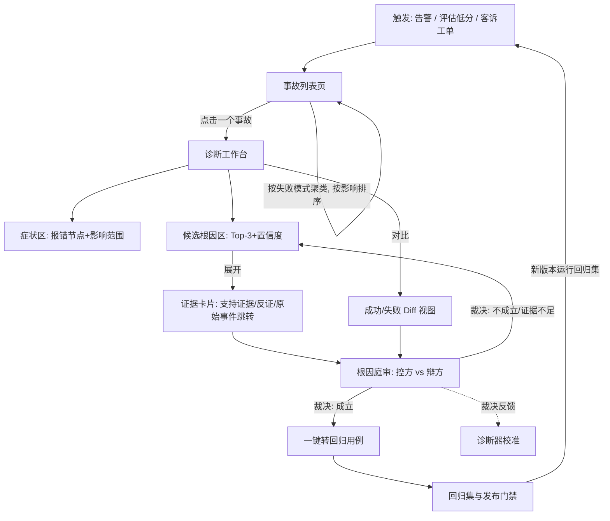
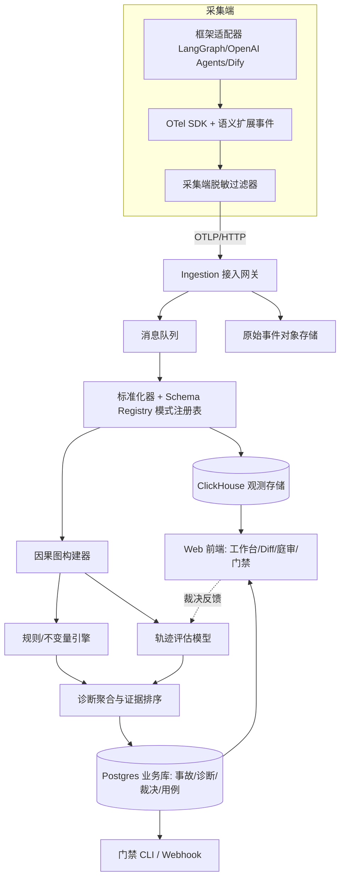

# CauseLens（因镜）产品设计与交付文档（第二周）

> 依据：`second-week/prompt-优化版.md`（14 项任务，与 `second-week/promt.md` 一一对应）与第一周研究结论（`first-week/agent-tracing-competitive-analysis.md`）
> 交付日期：2026-08-17
> 配套原型：`second-week/agent-tracing-prototype.html`（单文件、离线可开、可点击，版本 v1.1，已并入可用性走查迭代与微交互动效）
> 标签说明：**[承接]** 直接来自第一周结论；**[细化]** 本周在既有结论上的具体化；**[决策]** 本周新做出并附依据的设计决策

---

## 方案摘要（一页）

**产品一句话定义：** CauseLens（因镜）为运行多 Agent 系统的平台团队与 SRE（站点可靠性工程师），在生产事故发生时，给出**最早的故障因（首故障点）、完整证据链和验证办法**，而不是让人在几百个 Span（链路片段）里自己找答案。

**核心流程一张图：**


**三个差异化要点（对比 AgentLoop）：**

1. **诊断工作台替代五视图切换** —— 打开事故直接看到「症状 → 候选根因 → 证据 → 验证动作」，不用在树、图、时序、轨迹之间来回找；
2. **证据卡片替代文本总结** —— 每条 AI 结论强制引用 Span ID、状态 Diff、工具参数，同时给出反证和置信度，可一键跳到原始事件；
3. **三步闭环替代跨模块跳转** —— 从发现问题到生成回归用例，主操作不超过三次（打开事故 → 裁决 → 转用例）。

**创新亮点：** 「根因庭审」——AI 同时扮演控方（论证根因成立）与辩方（专职寻找反证），用户当法官裁决。用对抗式呈现对冲 AI 幻觉和用户的自动化偏见，裁决结果直接校准诊断器。

**最大风险：** 诊断误报导致信任崩塌。缓解：确定性规则先行、证据强制引用、低置信度降级为「线索」而非「结论」、裁决反馈闭环校准（详见任务 13）。

---

## 目录

按 `promt.md` 的 14 项任务逐项成章，可对照检查完成度：

1. [任务 1：核心流程设计](#任务-1核心流程设计)
2. [任务 2：Demo 输出（页面设计稿）](#任务-2demo-输出页面设计稿)
3. [任务 3：产品方案说明](#任务-3产品方案说明)
4. [任务 4：差异化设计落地](#任务-4差异化设计落地)
5. [任务 5：PRD——功能、流程、边界](#任务-5prd功能流程边界)
6. [任务 6：异常流程补全](#任务-6异常流程补全)
7. [任务 7：可点击原型](#任务-7可点击原型)
8. [任务 8：技术方案草图](#任务-8技术方案草图)
9. [任务 9：测试用例设计](#任务-9测试用例设计)
10. [任务 10：可用性测试（3 人走查与迭代）](#任务-10可用性测试3-人走查与迭代)
11. [任务 11：微交互 / 情感化设计](#任务-11微交互--情感化设计)
12. [任务 12：设计说明与决策文档](#任务-12设计说明与决策文档)
13. [任务 13：质量风险前置评估](#任务-13质量风险前置评估)
14. [任务 14：创新亮点：根因庭审](#任务-14创新亮点根因庭审)
15. [本期未决问题与下期验证项](#本期未决问题与下期验证项)

---

## 任务 1：核心流程设计

### 1.1 主流程

**[承接]** 第一周选定场景「跨 Agent 因果故障定位与证据化回放」（第一周 4.1 节），主流程覆盖从问题触发到复发预防的完整闭环。



### 1.2 步骤级说明

| 步骤 | 输入 | 用户决策点 | 输出 | 对应页面 |
|---|---|---|---|---|
| 1. 触发 | 告警规则命中 / Judge（评审器）低分 / 手动上报 | 无（系统自动） | 新事故记录，归入失败模式簇 | — |
| 2. 浏览事故 | 事故列表 + 失败模式聚类 | 先处理哪个簇/事故（按影响面排序辅助） | 选中一个事故 | 事故列表页 |
| 3. 看诊断 | 首故障点标注 + Top-3 候选根因 + 置信度 | 是否采信候选、看哪条证据 | 理解「哪一步先出的错」 | 诊断工作台 |
| 4. 查证据 | 证据卡片（Span ID、状态 Diff、工具参数）+ 反证 | 证据是否充分 | 形成个人判断 | 证据卡片抽屉 |
| 5. 比 Diff | 同类成功链 vs 失败链的状态/交接/工具对比 | 差异是否解释失败 | 确认或排除候选 | Diff 视图 |
| 6. 裁决 | 控方论证 + 辩方反证并排呈现 | **成立 / 不成立 / 证据不足**（必选其一） | 裁决记录 + 校准信号 | 根因庭审 |
| 7. 转用例 | 已裁决成立的事故（输入、上下文、期望不变量） | 用例归入哪个回归集 | 回归用例（含脱敏快照） | 转用例弹窗 |
| 8. 门禁 | 新版本对回归集的运行结果 | 警告后是否放行（默认警告不阻断） | 发布检查报告 | 门禁页 |

### 1.3 信息架构（站点地图）

```text
CauseLens
├─ ① 总览 / 事故列表          ← 默认落地页
│   ├─ 失败模式聚类卡（按影响排序）
│   └─ 事故列表（筛选：Agent / 时间 / 状态 / 置信度）
├─ ② 诊断工作台               ← 核心页面
│   ├─ 症状区（报错节点、影响范围、发生次数）
│   ├─ 候选根因区（Top-3 + 置信度 + 判定来源：规则/模型）
│   ├─ 证据卡片抽屉（支持证据 / 反证 / 跳原始事件）
│   ├─ 因果路径迷你图（首故障点 → 传播 → 报错点）
│   └─ 底部下钻：完整 Trace 树（按需展开）
├─ ③ 成功/失败 Diff
│   ├─ 状态 Diff（state_before/after 哈希对比）
│   ├─ 交接 Diff（handoff 契约字段对比）
│   └─ 工具 Diff（参数与结果对比）
├─ ④ 根因庭审（创新点）
│   ├─ 控方（论证成立）/ 辩方（专职反证）
│   └─ 法官裁决区（成立 / 不成立 / 证据不足）
├─ ⑤ 回归集与门禁
│   ├─ 回归用例列表（来自已裁决事故）
│   └─ 门禁运行报告（通过 / 警告 / 阻断）
├─ ⑥ 接入与采集体检
│   ├─ 接入引导（OTel + 框架适配）
│   └─ 体检报告（覆盖率 / 断链 / 重复 / 敏感字段）
└─ ⑦ 设置（项目 / 成员权限 / 脱敏策略 / 告警规则）
```

**[细化]** 与第一周 2.4 节 AgentLoop 信息架构的关键差异：AgentLoop 以「数据类型」组织导航（链路 / 会话 / 模型 / 工具分析），CauseLens 以「故障假设的推进」组织导航（发现 → 诊断 → 验证 → 沉淀），每个页面回答排障过程中的一个问题。

---

## 任务 2：Demo 输出（页面设计稿）

本章是任务 7 可点击原型的蓝图：对站点地图（1.3 节）中的 7 个页面逐一给出设计稿。每份设计稿包含页面目标、区块划分（ASCII 布局）、**第一眼要素**（打开页面 3 秒内必须看到的结论性信息，落实设计原则 1「结论先行」）、主/次操作与页面间数据传递。原型页面与本章一一对应（对照关系见 7.1 节）。

### 2.1 页面① 事故列表（默认落地页）

- **页面目标：** 值班第一屏回答「今天最该先处理哪类失败」。
- **第一眼要素：** 失败模式簇卡按影响排序，最严重簇（红色计数 + 趋势箭头）+ 其最高置信诊断摘要。

```text
┌───────────────────────────────────────────────────────┐
│ [簇卡×4] 过期状态污染 12起▲ │ 契约缺字段 7起 │ 参数格式 5起▼ │ 检索不相关 3起 │
│          每卡：模式名 / 24h次数与趋势 / 影响会话 / 最高置信诊断摘要 │
├───────────────────────────────────────────────────────┤
│ [筛选行] 簇 ▾  Agent ▾  时间 ▾  裁决状态 ▾  置信度 ▾        │
├───────────────────────────────────────────────────────┤
│ [事故表] ID │ 时间 │ 入口Agent │ 症状 │ 首故障点(候选) │ 置信度条 │ 裁决状态 │
│ [表尾] 判例提示：已裁决成立 N 条 → 判例库用于本簇置信度加权   │
└───────────────────────────────────────────────────────┘
```

- **主操作：** 点击事故行 → 进入诊断工作台。**次操作：** 点击簇卡 → 筛选列表并定位（走查迭代 P-1：原直接跳转改为筛选，见 10.4 节）；筛选组合。
- **数据传递（→ 工作台）：** `incident_id`、`trace_id`、所属簇 `cluster_id`（用于「同模式历史次数」）、列表中的裁决状态（工作台顶部同步显示）。

### 2.2 页面② 诊断工作台（核心页面）

- **页面目标：** 一屏回答「哪一步先出的错、证据是什么、下一步怎么验证」。
- **第一眼要素：** 症状区的报错节点 + 候选根因 1 的一句话结论与置信度（默认展开）。

```text
┌───────────────────────────────────────────────────────┐
│ [症状条] 报错节点 S9·422 │ 影响 9会话/7用户 │ 失败模式 FM-01 │ 数据完整度 92% │
├───────────────────────────────────────────────────────┤
│ [因果路径] S1 → S2 → ⚑S3(首故障点) → S4 → S5 → S7 → ✖S9(报错点)   │
│            节点可点击跳转原始事件；说明行：报错点距首故障点 6 步       │
├───────────────────────────────────────────────────────┤
│ [候选根因 Top-3]（诊断加载态：规则候选先行，模型候选异步追加）        │
│  #1 记忆快照过期  [规则判定] 86% ─ 展开=证据抽屉(支持4/反证2)+庭审入口 │
│  #2 契约缺字段    [模型推断] 41% ─ 含强反证提示                      │
│  #3 线索(折叠)    [模型推断] 22% ─ 低置信降级，庭审入口禁用(G-2)      │
├───────────────────────────────────────────────────────┤
│ [完整 Trace 树] 默认折叠，标题点击展开；证据跳转在此驻留高亮          │
└───────────────────────────────────────────────────────┘
```

- **主操作：** 展开候选 → 阅读证据 → 「进入根因庭审」。**次操作：** 「成功/失败 Diff」、证据引用跳原始事件、展开 Trace 树、「查看体检」。
- **数据传递（→ Diff）：** `trace_id`（失败链）+ 推荐 `baseline_trace_id` + 候选根因引用的证据锚点（Diff 页据此打「证据」角标）。（→ 庭审）：`candidate_id` + 全部证据/反证引用。

### 2.3 页面③ 成功/失败 Diff

- **页面目标：** 回答「和正常的那次差在哪」，把差异直接关联到证据。
- **第一眼要素：** 基线说明（推荐依据三条件）+ 三个维度卡各自的差异数标签（如「状态 Diff · 3 处差异」）。

```text
┌───────────────────────────────────────────────────────┐
│ [基线条] 基线 TRC-9f21（自动推荐：同版本/同任务/时间邻近）[更换基线]  │
├──────────────────────┬────────────────────────────────┤
│ ① 状态 Diff          │ 失败链列  vs  成功链列（差异行高亮）          │
│ ② 交接 Diff          │ 与候选根因相关的差异行带「证据 E2」角标        │
│ ③ 工具 Diff          │ 反证相关行注明（如「排除限流 → 候选3反证」）   │
├──────────────────────┴────────────────────────────────┤
│ [底部] ⚖ 差异已确认，进入根因庭审 │ ← 返回诊断工作台               │
└───────────────────────────────────────────────────────┘
```

- **主操作：** 「进入根因庭审」。**次操作：** 更换基线、返回工作台。
- **数据传递（→ 庭审）：** 用户在 Diff 页确认过的差异不改变数据，但 Diff 证据（E2/E4）在庭审控方论证中被引用回跳。

### 2.4 页面④ 根因庭审（创新点，详见任务 14）

- **页面目标：** 对候选根因做出必选裁决，同时对冲 AI 幻觉与自动化偏见。
- **第一眼要素：** 左右分栏的控方/辩方标题与候选结论摘要——用户 3 秒内知道「这里要我做判断，且有反对意见存在」。

```text
┌───────────────────────────────────────────────────────┐
│ [案情条] 候选 1 · 规则判定 86% · 一句话结论                        │
├───────────────────────────┬───────────────────────────┤
│ 🔍 控方 · 论证成立          │ 🛡 辩方 · 反证与替代解释              │
│  1️⃣过期事实(铁证·规则)      │  ⚡C1 过期不必然失败 + 控方回应        │
│  2️⃣数据失效  3️⃣传播链完整   │  ⚡C2 替代解释:限流 + 控方回应         │
│  4️⃣反事实成立 + 判例引用    │  ℹ️ 辩方声明:未找到其他有效反证        │
├───────────────────────────┴───────────────────────────┤
│ [裁决条(深色)] 法官裁决： [✔成立] [✘不成立] [？证据不足]            │
│ 裁决后 → 落定态：已裁决·转回归用例入口 + 发起改判入口                │
└───────────────────────────────────────────────────────┘
```

- **主操作：** 三选一裁决。**次操作：** 证据引用回跳工作台/Diff、裁决后「一键转回归用例」「发起改判」。
- **数据传递（→ 转用例弹窗）：** `incident_id`、裁决结论、根因类型（决定不变量模板）、输入摘要、`context_snapshot_ref`、自动反推的 `invariants[]`——弹窗内全部只读自动填充，无需人工字段映射。

### 2.5 页面⑤ 回归集与门禁

- **页面目标：** 让裁决过的事故变成发版防线，并回答「这次能不能放行」。
- **第一眼要素：** 门禁结论大字（通过/警告/阻断）+ 通过/警告/阻断计数。

```text
┌───────────────────────────────────────────────────────┐
│ [回归集表] 用例ID │ 来源事故 │ 期望不变量 │ 快照录制 │ 复核状态        │
│            新增用例行高亮（来自转用例流程）                         │
├───────────────────────────────────────────────────────┤
│ [门禁报告] 结论大字:警告 │ 通过11 │ 警告1 │ 阻断0 │ [推送Webhook]    │
│ [明细表] 逐用例结果；不变量违反定位到字段；连续命中提示升级阻断        │
│          + 「调整门禁模式 →」入口（走查迭代 P-3，见 10.4 节）        │
└───────────────────────────────────────────────────────┘
```

- **主操作：** 查看警告明细。**次操作：** 推送 Webhook、调整门禁模式（→ 设置页）。
- **数据传递（← 转用例弹窗）：** 新用例对象（含来源 `incident_id`、不变量、录制时间、复核状态=待复核）。

### 2.6 页面⑥ 接入与采集体检

- **页面目标：** 回答「我的数据可不可信」，并把每个问题变成可执行的修复动作。
- **第一眼要素：** 四项体检得分卡，异常项（断链）用警告色边框突出。

```text
┌───────────────────────────────────────────────────────┐
│ [得分卡×4] ①字段覆盖率92% │ ②断链2处⚠ │ ③重复Span14条 │ ④敏感拦截37处 │
├───────────────────────────────────────────────────────┤
│ [问题清单] 问题 │ 位置 │ 影响 │ 修复指引▾（展开=可复制代码片段）      │
│ [表尾] 体检每小时自动运行；得分作为诊断置信度前置门槛                 │
└───────────────────────────────────────────────────────┘
```

- **主操作：** 展开修复指引。**次操作：** 无（体检自动运行）。
- **数据传递（→ 工作台）：** 数据完整度分数显示在工作台症状区，完整度不足时相关规则禁用并明示「数据不足」（异常 D-3）。

### 2.7 页面⑦ 设置

- **页面目标：** 项目隔离、角色权限、脱敏策略、告警规则、门禁模式的集中管理。
- **第一眼要素：** 成员角色表（谁能裁决一目了然）。
- **区块：** 成员与角色（三档：查看者/分析师/裁决人）、脱敏策略（规则 + 近 7 天命中数）、告警规则（阈值 + 状态）、门禁模式（警告/阻断切换，注明决策 D-5 建议）。
- **主操作：** 门禁模式切换。**次操作：** 查看脱敏命中、告警阈值。第一期不做的功能（邀请成员/SSO）显示禁用态并注明。

---

## 任务 3：产品方案说明

### 3.1 为什么（谁在痛，代价是什么）

**[承接第一周 4.2 节]** 运行多 Agent 系统的团队（AI 平台负责人、Agent Owner、SRE）面临一个具体困境：**最后报错的节点不是根因节点**。上游 Agent 写入了过期状态、交接时丢了字段、记忆里存了脏数据，错误沿着链路放大，最后在某个下游工具调用处爆掉。现有工具（含 AgentLoop）能把几百个 Span 完整展示出来——树、图、时序、轨迹五种视图——但「哪一步先出的错、为什么」仍然要人翻着看。

代价可量化：排障工时（一次跨 Agent 事故平均需要资深工程师半天到两天）、事故影响时间（MTTR，平均修复时长）、同类问题复发（经验沉在个人聊天记录里，换个人接手重新踩坑）。

### 3.2 解决什么问题

**场景定义（一句话，承接第一周 4.7 节格式）：**

> 为【运行多 Agent 生产系统的平台团队与 SRE】在【生产事故排查】情境下解决【报错节点不等于根因节点、证据散落难以定位】的问题，通过【首故障点定位 + 证据化诊断 + 成功/失败 Diff + 裁决闭环】实现【MTTR 下降、同类问题不复发、修复可验证】。

**三个可衡量的价值指标（承接第一周场景 1 关键指标）：**

1. 首故障点 Top-3 命中率 ≥ 70%（用已知根因事故集实测）；
2. 证据接受率 ≥ 60%（用户裁决「成立」的比例）；
3. 从打开事故到生成回归用例 ≤ 3 次主操作、≤ 10 分钟。

### 3.3 怎么解决（五层机制，讲给不懂技术的人）

1. **数据层——先把过程记全。** 通过标准探针（OTel，开放遥测）记录每个 Agent 做了什么：调了哪个模型、用了哪个工具、读写了什么状态和记忆、交接给谁。就像给整条流水线装监控摄像头。
2. **因果层——把「先后」变成「因果」。** 系统把这些记录连成一张因果图：谁写的状态被谁读了、谁的输出成了谁的输入。摄像头拍的是画面，因果图画的是「谁碰了谁」。
3. **证据层——先用规则抓现行，再用模型断疑案。** 格式错了、字段丢了、状态过期了——这类确定性问题用规则直接判定，铁证如山；「答案看着对但业务上错了」这类语义问题才交给模型分析，且模型必须指出具体证据，说不出证据的结论不许上屏。
4. **裁决层——AI 起诉，人拍板。** 系统把「根因成立的理由」和「不成立的反证」摆在一起（根因庭审），由工程师裁决。裁对裁错都被记下来，系统越用越准。
5. **资产层——裁过的案子变成防线。** 每个裁决成立的事故一键变成回归用例，下次发版前自动重跑，同样的坑不踩第二次。

---

## 任务 4：差异化设计落地

**[承接]** 第一周 10.2 节主方向 Causal-first Debugger 的五个可感知差异，逐条落到具体设计。每条均可在原型中指认。

| # | AgentLoop 现状与不足（第一周证据） | CauseLens 具体设计 | 用户第一眼的不同 | 原型位置 |
|---|---|---|---|---|
| 1 | 五种 Trace 视图（树/图/时序/轨迹/分析）信息完整但认知切换多，缺少统一诊断答案（第一周 9 节缺陷 3） | **诊断工作台**为核心页面：症状、Top-3 候选根因、因果路径迷你图、证据入口集中在一屏；Trace 树降级为底部按需下钻 | 打开事故先看到「结论候选」，而不是一棵几百节点的树 | 页面② |
| 2 | STAROps 与 Judge 输出偏热点识别与评分文本，无强制证据引用（第一周 7 节） | **证据卡片**：每条候选根因挂支持证据与反证，每条证据引用 Span ID / 状态 Diff / 工具参数，点击直达原始事件；无证据引用的结论在产品上不允许渲染 | AI 说的每句话都能点进去验证，还主动给出「反对自己」的证据 | 页面②证据抽屉 |
| 3 | 只能查看单条链路，判断「和正常的差在哪」靠人脑记忆（第一周 8 节旅程阶段 3） | **成功/失败 Diff**：自动检索同类成功链，按状态、交接、工具三个维度并排对比，差异行高亮 | 像看代码 Diff 一样看两次执行的差异 | 页面③ |
| 4 | QuickStart 依赖链长、失败不回滚、无采集完整度反馈（第一周 9 节缺陷 1、4） | **接入体检**：接入后自动出体检报告——字段覆盖率、断链数、重复 Span、敏感字段暴露，每项附一键修复指引 | 接完就知道「数据可不可信」，而不是等排障时才发现漏采 | 页面⑥ |
| 5 | Trace→评估→数据集→实验闭环完整但跨模块操作多、字段映射靠人工（第一周 9 节缺陷 7） | **三步闭环**：打开事故（1）→ 庭审裁决（2）→ 转回归用例（3）；用例自动携带输入、上下文快照与期望不变量，无需字段映射 | 从「看到问题」到「防住问题」三次点击 | 页面④→⑤ |

---

## 任务 5：PRD——功能、流程、边界

### 5.0 模块与优先级总览

| 模块 | 优先级 | 一句话职责 |
|---|---|---|
| M1 接入与采集体检 | P0 | 数据进得来，且知道数据可不可信 |
| M2 事故列表与失败模式聚类 | P0 | 从海量执行里知道先看哪个 |
| M3 因果诊断工作台 | P0 | 回答「哪一步先出的错、为什么」 |
| M4 成功/失败 Diff | P0 | 回答「和正常的差在哪」 |
| M5 根因庭审（裁决与反馈） | P0 | 人拍板，AI 被校准 |
| M6 回归用例与发布门禁 | P1 | 裁过的案子变成防线 |
| M7 设置与权限 | P1 | 项目隔离、脱敏策略、告警规则 |

### M1 接入与采集体检（P0）

- **用户故事：** 作为平台工程师，我想在接入后立刻知道采集是否完整、有没有泄露敏感数据，以便敢把它用于生产排障。
- **功能描述：** 提供 OTel OTLP 接入端点与 LangGraph、OpenAI Agents SDK、Dify 三个框架适配器（**[承接]** 第一周 11.1 节「2–3 个主流框架」）。接入后 5 分钟内生成体检报告，四项体检：①字段覆盖率（必采字段的到位比例）②断链检测（父子 Span 无法关联的比例）③重复 Span 检测（同一事件被采两次）④敏感字段扫描（正则 + 词典识别手机号、身份证、密钥）。
- **输入/输出：** 输入 OTLP 数据流；输出体检报告对象（四项得分 + 问题清单 + 修复指引链接）。
- **边界：** 不做通用 APM 指标采集；不支持第一期外的框架（**[承接]** 第一周 11.1 明确不做项）；敏感字段扫描只提示不自动删改（避免误伤业务数据）。
- **验收标准：** AC1-1 接入演示 Agent 后 5 分钟内出体检报告；AC1-2 人为制造断链/重复/敏感字段后，体检报告能检出并给出修复指引；AC1-3 覆盖率计算与人工核对误差 ≤ 2%。

### M2 事故列表与失败模式聚类（P0）

- **用户故事：** 作为 SRE，值班时我想知道「今天最该先处理哪类失败」，而不是逐条翻错误 Trace。
- **功能描述：** 失败 Trace 自动归入失败模式簇（第一期规则聚类：按首故障点类型 + 报错工具 + 错误码组合；**[决策]** 语义聚类放第二期，见任务 12 决策 D-4）。簇卡片展示：模式名称、24h 发生次数、影响会话数、趋势、最高置信度诊断摘要。列表支持按 Agent、时间段、裁决状态、置信度筛选。
- **输入/输出：** 输入失败 Trace 流；输出簇列表 + 事故列表。
- **边界：** 不做任意维度的自定义聚合分析（那是 BI 的事）；单簇最多展示最近 500 条事故，更早的走归档查询。
- **验收标准：** AC2-1 同一根因模式的事故聚到同簇的比例 ≥ 80%（用已知模式事故集实测）；AC2-2 列表首屏加载 ≤ 2s（1 万条事故量级）；AC2-3 每个筛选条件独立生效且可组合。

### M3 因果诊断工作台（P0）

- **用户故事：** 作为 Agent Owner，打开一个事故时我想在一屏内看到「哪一步先出的错、证据是什么」，而不是自己翻几百个 Span。
- **功能描述：** 工作台分四区：
  1. **症状区**：报错节点、错误信息、影响范围（会话数/用户数）、同模式历史次数；
  2. **候选根因区**：Top-3 候选，每条含一句话结论、置信度、判定来源标签（`规则判定`（确定性）或 `模型推断`（语义），**[承接]** 第一周 4.5 节「先规则后模型」路径）；
  3. **因果路径迷你图**：首故障点 → 传播路径 → 报错点，节点可点击跳转对应 Span；
  4. **证据抽屉**：点开候选根因展示支持证据与反证列表，每条证据引用具体事件（Span ID、状态 Diff、工具参数、记忆读写），点击跳原始事件详情。
  底部提供完整 Trace 树，默认折叠，按需下钻。
- **输入/输出：** 输入事故 ID；输出诊断对象（候选根因 + 证据引用 + 置信度）。
- **边界：** 不自动修复、不自动定责（**[承接]** 第一周 4.7 节反方回应：先做辅助定位）；置信度 < 40% 的候选降级显示为「线索」并折叠（见任务 6 异常 G-2）；单事故候选根因最多 3 条。
- **验收标准：** AC3-1 已知根因事故集上 Top-3 命中率 ≥ 70%；AC3-2 每条上屏结论 100% 带可点击证据引用（无证据结论渲染为空即为 bug）；AC3-3 工作台首屏（不含 Trace 树）加载 ≤ 3s。

### M4 成功/失败 Diff（P0）

- **用户故事：** 作为开发，我想把这条失败执行和一条正常执行摆在一起，看看状态、交接、工具参数差在哪。
- **功能描述：** 系统按「同 Agent 版本 + 同任务类型 + 时间邻近」自动推荐基线成功链（用户可手动更换）。三个维度并排对比：状态 Diff（state_before/after 的字段级差异）、交接 Diff（handoff 契约字段有无与值差异）、工具 Diff（参数与返回的差异）。差异行高亮，与候选根因相关的差异行标记「证据」角标。
- **输入/输出：** 输入失败 Trace ID + 基线 Trace ID；输出三维度 Diff 结构。
- **边界：** 找不到可比成功链时明确提示并允许跳过（见任务 6 异常 G-5），不硬凑基线；大字段（>10KB）只对比哈希与摘要，不做全文 Diff。
- **验收标准：** AC4-1 自动推荐基线的可用率 ≥ 80%（用户未更换即使用）；AC4-2 已知差异注入后 Diff 100% 检出；AC4-3 Diff 页加载 ≤ 3s。

### M5 根因庭审：裁决与反馈（P0）

- **用户故事：** 作为资深工程师，我不想被 AI 的一面之词带偏；我想同时看到「为什么成立」和「为什么可能不成立」，然后自己拍板。
- **功能描述：** 对选中的候选根因，左右分栏呈现——控方（支持证据 + 论证逻辑）与辩方（系统强制生成的反证与替代解释）。底部裁决区三个必选按钮：**成立 / 不成立 / 证据不足**。裁决后：「成立」→ 引导转回归用例；「不成立」→ 要求选择理由（证据错误 / 因果不成立 / 另有根因）并可指认正确根因；「证据不足」→ 生成待补数据清单（缺哪类事件）。所有裁决写入校准日志，作为诊断器的反馈信号。支持改判（保留裁决历史，见任务 6 异常 U-1）。
- **输入/输出：** 输入候选根因 ID；输出裁决记录（结论 + 理由 + 裁决人 + 时间）。
- **边界：** 裁决不可跳过——未裁决的事故不能转回归用例（**[决策]** 见任务 12 决策 D-3）；裁决权限仅限项目成员中的「裁决人」角色。
- **验收标准：** AC5-1 每次裁决必须落库且可查历史；AC5-2 辩方区 100% 有内容（找不到实质反证时明确显示「未找到有效反证」而不是空白）；AC5-3 改判后旧裁决保留且校准信号同步更新。
- **详细设计见任务 14（创新亮点）。**

### M6 回归用例与发布门禁（P1）

- **用户故事：** 作为 Agent Owner，我想让每个修过的事故变成发版前的自动检查，同样的坑不踩第二次。
- **功能描述：** 「成立」裁决后一键转回归用例：自动打包输入、上下文快照（脱敏后）、期望不变量（从根因反推，如「refund_amount ≤ refundable_amount」）。用例归入回归集。新版本发布前运行回归集，输出门禁报告：通过 / 警告 / 阻断。**[决策]** 默认只警告不阻断，团队可按回归集配置为阻断（依据见任务 12 决策 D-5）。
- **输入/输出：** 输入已裁决事故；输出回归用例（快照 + 不变量）与门禁报告。
- **边界：** 不做完整 CI/CD（持续集成/交付）系统，只提供 CLI（命令行）与 Webhook（网络钩子）供现有流水线调用；快照回放第一期只支持「工具打桩回放」（用录制的工具返回值），不做真实外部调用重放。
- **验收标准：** AC6-1 转用例操作 ≤ 2 步且字段自动填充；AC6-2 注入已知回归后门禁能报警；AC6-3 门禁结果可通过 Webhook 推送。

### M7 设置与权限（P1）

- **用户故事：** 作为平台管理员，我要隔离不同业务的项目数据、控制谁能裁决、配置脱敏规则。
- **功能描述：** 项目级隔离；角色三档：查看者（只读）、分析师（可诊断、不可裁决）、裁决人（可裁决与改判）；脱敏策略（字段白名单 + 正则规则，采集端优先执行，**[承接]** 第一周 11.4 节）；告警规则（按失败模式簇的次数/比例阈值）。
- **边界：** 第一期不做 SSO（单点登录）与审计导出；不做跨项目数据共享。
- **验收标准：** AC7-1 三档角色权限边界经测试用例逐条验证；AC7-2 脱敏规则生效后原文不落库（抽样审计验证）。

---

## 任务 6：异常流程补全

统一结构：触发条件 → 系统行为 → 用户可见文案 → 恢复路径。

### 6.1 数据侧

| # | 异常 | 触发条件 | 系统行为 | 用户可见文案（示意） | 恢复路径 |
|---|---|---|---|---|---|
| D-1 断链 Trace | 子 Span 的 traceparent 丢失，无法挂到调用树 | 启发式关联（时间窗 + 会话 ID + Agent ID）；关联成功打「推测关联」标；失败则挂「孤儿区」 | 「该链路存在 2 处断链，因果分析可能不完整。查看接入修复指引 →」 | 体检页给出具体断链位置与框架侧修复代码片段 |
| D-2 重复 Span | 框架插件与裸 SDK 双重上报（第一周 9 节缺陷 4） | 按（trace_id, span 语义指纹, 时间容差）去重，保留信息更全的一条，原始都留档 | 体检报告：「检测到重复采集，已自动去重，建议移除重复接入点」 | 修复指引指明重复来源（插件 vs SDK） |
| D-3 字段缺失 | 必采字段（如 state diff、handoff 契约）为空 | 该维度的诊断规则自动禁用并标注「数据不足」；不硬猜 | 「缺少状态变更数据，无法进行状态污染分析。补齐方法 →」 | 体检页字段覆盖清单 + 补采指引 |
| D-4 超大 Trace | 单 Trace 节点数 > 1000 或大字段 > 10KB | 列表虚拟滚动；大字段存对象存储只展示摘要+哈希，点击按需加载；因果图聚合重复节点（**[承接]** 第一周 11.4 节） | 「该链路较大（1,842 节点），已聚合展示，点击节点展开」 | 无需恢复，属降级展示 |
| D-5 敏感数据 | 采集流中命中敏感字段规则 | 采集端脱敏（掩码/哈希），服务端策略兜底；命中记录进体检报告 | 「本项目上周拦截 37 处敏感字段，查看脱敏策略 →」 | 设置页调整白名单与规则 |

### 6.2 诊断侧

| # | 异常 | 触发条件 | 系统行为 | 用户可见文案 | 恢复路径 |
|---|---|---|---|---|---|
| G-1 无候选根因 | 规则未命中且模型无有效输出 | 不编造结论；展示因果路径图 + 「相似历史事故」检索结果作为线索 | 「暂未定位到候选根因。以下是 3 条相似历史事故与其裁决结论，供参考」 | 用户可手动标注根因，进入校准数据 |
| G-2 置信度过低 | 所有候选置信度 < 40% | 候选降级为「线索」，折叠展示，不进入庭审流程 | 「以下为低置信度线索，仅供参考，不建议直接采信」 | 补充数据后可触发重新诊断 |
| G-3 证据矛盾 | 支持证据与反证同时为强证据（规则级） | 标记「证据冲突」，强制走庭审，冲突证据置顶并排 | 「该候选存在相互矛盾的强证据，请人工裁决」 | 庭审裁决 + 理由记录 |
| G-4 模型超时/失败 | 轨迹模型调用超时（>30s）或连续失败 | 规则判定结果照常展示；模型部分显示重试入口；不阻塞页面 | 「语义分析暂不可用（已重试 2 次），确定性判定不受影响。重试 →」 | 手动重试；连续失败告警到管理员 |
| G-5 无可比基线 | 「同版本 + 同任务 + 时间邻近」三条件检索不到成功链 | Diff 页明示无基线并允许跳过，不硬凑相似度不足的基线误导用户 | 「未找到满足条件的可比成功链。你可以放宽条件手动选择，或跳过 Diff 直接进入庭审」 | 放宽检索条件手动选基线，或跳过 |

### 6.3 用户侧

| # | 异常 | 触发条件 | 系统行为 | 用户可见文案 | 恢复路径 |
|---|---|---|---|---|---|
| U-1 误裁决改判 | 裁决人对已裁决事故发起改判 | 保留完整裁决历史（谁、何时、结论、理由）；校准信号按最新裁决更新；关联回归用例标记「待复核」 | 「改判成功。由此生成的回归用例 REG-1041 已标记待复核」 | 复核或删除关联用例 |
| U-2 并发裁决冲突 | 两名裁决人同时对同一候选裁决 | 乐观锁：后提交者看到先裁决结果与理由，选择附议或发起改判，不静默覆盖 | 「张工 2 分钟前已裁决为『成立』。你可以附议或发起改判」 | 附议 / 改判流程 |
| U-3 权限不足 | 查看者/分析师点击裁决按钮 | 按钮呈禁用态并带悬浮说明，不隐藏（让用户知道功能存在） | 「裁决需要『裁决人』权限，可联系项目管理员开通」 | 设置页申请权限 |
| U-4 空状态/首次引导 | 新项目无数据 / 无事故 | 空状态页展示接入引导三步卡；有数据无事故时展示「一切正常」+ 最近体检摘要 | 「还没有数据。三步完成接入：①装 SDK ②配环境变量 ③跑一次 Agent」 | 接入向导 |

---

## 任务 7：可点击原型

原型文件：`second-week/agent-tracing-prototype.html`。单文件、内嵌 CSS/JS、离线双击可开。当前版本 **v1.2**：v1.1（走查迭代 + 微交互）基础上按「调查案卷」视觉方向重构（见 11.1 节视觉体系）。

**演示用模拟案例（与本文档同一套数据）：** 「订单助手」多 Agent 客服系统（Planner 规划、OrderAgent 订单查询、KnowledgeAgent 知识/记忆检索、RefundAgent 退款执行、Notifier 通知）。核心事故 `INC-2026-0814-003`：用户申请退款 ¥180，RefundAgent 调用退款接口返回 422 失败。**表面报错**在第 9 步退款工具调用；**真实根因**在第 3 步——KnowledgeAgent 读取了 4 小时前的记忆快照 `order_snapshot v3`（状态 PAID、可退 ¥180），而订单真实状态已是 PARTIALLY_REFUNDED（可退 ¥60），过期状态经交接传给 RefundAgent 导致超额退款请求。

### 7.1 页面清单与设计稿对照

| 原型页面（导航项） | 设计稿 | PRD 模块 |
|---|---|---|
| 事故列表 | 2.1 | M2 |
| 诊断工作台 | 2.2 | M3 |
| 成功/失败 Diff | 2.3 | M4 |
| 根因庭审 | 2.4 | M5（+ 任务 14） |
| 回归集与门禁 | 2.5 | M6 |
| 接入体检 | 2.6 | M1 |
| 设置 | 2.7 | M7 |

### 7.2 演示路径（原型顶部有同款引导，步骤编号可点击直达）

1. 事故列表 → 点簇卡「过期状态污染」筛选定位（走查迭代后，簇卡点击=筛选而非跳转）→ 点开列表中的 INC-2026-0814-003；
2. 诊断工作台 → 先看到规则候选与「语义分析中」加载态（约 1.1s 后模型候选渐入，演示「规则先行、模型异步」时序，见 8.4 节）→ 症状区 + Top-3 候选 + 因果路径图 → 展开证据抽屉，点击证据引用跳转原始事件（Trace 树驻留高亮）；
3. 成功/失败 Diff → 与成功链 TRC-9f21 对比，状态/交接/工具三维差异；
4. 根因庭审 → 控方 4 条证据 vs 辩方 2 条反证 → 裁决「成立」（落定动效）；
5. 转回归用例 → 自动生成 REG-1041（含期望不变量，新行高亮滑入）→ 门禁页看运行结果（警告脉冲提示）；
6. 接入体检 → 覆盖率/断链/重复/敏感字段四项报告。

**异常状态演示（对应任务 6）：** ①体检页断链警告（D-1，含修复指引）；②工作台候选 3 为低置信度「线索」折叠态、庭审入口禁用（G-2）。另有 U-3 权限禁用态（设置页「邀请成员」）与快照过期提示（门禁页 REG-1015）。

### 7.3 关键可操作交互

筛选（簇卡与筛选行）、展开证据（候选抽屉）、证据引用跳原始事件（驻留高亮）、Diff 对比、庭审三选一裁决（成立/不成立带理由/证据不足带待补清单）、一键转回归用例（字段自动填充）、门禁 Webhook 推送、体检修复指引展开。不可用功能一律显示禁用态并注明原因，不假装可点。

---

## 任务 8：技术方案草图

**[承接]** 第一周 11.2 节推荐架构，不推翻，细化到接口与字段。

### 8.1 高层架构



### 8.2 核心接口草案（8 个关键 API）

| # | 方法与路径 | 用途 | 请求要点 | 响应要点 |
|---|---|---|---|---|
| 1 | `POST /v1/otlp/traces` | OTLP 标准接入 | OTLP protobuf/JSON；扩展属性走 `causelens.*` 命名空间（task/handoff/state/memory/artifact 事件） | 202 + 采集批次 ID |
| 2 | `GET /v1/projects/{pid}/checkup` | 采集体检报告 | 时间范围 | 四项得分、问题清单（含 span 定位）、修复指引 key |
| 3 | `GET /v1/projects/{pid}/incidents` | 事故列表 | 筛选：cluster_id、agent、time、verdict_status、min_confidence；分页游标 | 簇摘要 + 事故摘要列表 |
| 4 | `GET /v1/incidents/{iid}/diagnosis` | 诊断结果 | — | symptom、candidates[]（cause、confidence、source: rule/model、evidence_refs[]、counter_evidence_refs[]）、causal_path[] |
| 5 | `GET /v1/incidents/{iid}/diff?baseline={tid}` | 成功/失败 Diff | 可选 baseline，缺省用推荐基线 | state_diff[]、handoff_diff[]、tool_diff[]、baseline_meta（推荐依据）；无可比基线时返回空 baseline + 原因（对应异常 G-5） |
| 6 | `POST /v1/candidates/{cid}/verdict` | 提交裁决 | verdict: upheld/rejected/insufficient；reason_code；correct_cause_ref?；If-Match 版本头（并发控制，对应异常 U-2） | 裁决记录；409 时返回已有裁决供附议/改判 |
| 7 | `POST /v1/incidents/{iid}/regression-case` | 转回归用例 | suite_id；自动打包 input、context_snapshot_ref、invariants[] | 用例 ID + 快照脱敏摘要 |
| 8 | `POST /v1/suites/{sid}/gate-run` | 门禁运行（CLI/Webhook 调用） | release 版本、agent 版本、mode: warn/block | 报告：pass/warn/block、逐用例结果、不变量违反明细 |

### 8.3 核心数据结构（字段级）

**[承接]** 第一周 11.3 节对象清单，补齐类型、索引与存储位置。

**观测侧（ClickHouse，按 `(tenant_id, project_id, toDate(ts))` 分区，`(trace_id, ts)` 排序键）：**

```text
spans                                      -- 原子步骤宽表
  trace_id String, span_id String, parent_span_id String
  ts DateTime64, duration_ms UInt32
  kind Enum(ENTRY|AGENT|LLM|TOOL|RAG|MEMORY|HANDOFF)
  agent_id/agent_version String, status Enum(OK|ERROR), error_code String
  input_ref/output_ref String              -- >10KB 落对象存储，存引用+哈希+摘要
  tokens_in/out UInt32, attrs Map(String,String)
  link_kind Enum(NONE|INFERRED)            -- 断链启发式关联标记（对应异常 D-1）

events_state                               -- 状态读写事件
  trace_id, span_id, state_key String
  before_hash/after_hash String, diff_ref String
  writer_agent/reader_agent String, snapshot_version String, snapshot_age_s UInt32

events_handoff                             -- 交接事件
  source_agent/target_agent String, contract_version String
  fields_present Array(String), fields_missing Array(String)
  payload_ref String, accepted Bool, reject_reason String

events_memory                              -- 记忆读写
  memory_id/version String, op Enum(READ|WRITE)
  source String, retrieval_score Float32, written_at DateTime64  -- 用于过期判定
```

**业务侧（Postgres）：**

```text
incidents(id, project_id, trace_id, cluster_id, symptom_span_id,
          impact_sessions, status, created_at)
failure_clusters(id, project_id, signature,          -- 首故障类型+工具+错误码
          title, count_24h, trend)
diagnoses(id, incident_id, generated_at, model_version, rule_pack_version)
candidates(id, diagnosis_id, rank, cause_type, summary,
          confidence Float, source ENUM(rule, model),
          first_fault_span_id, causal_path JSONB)     -- span_id 有序数组
evidence(id, candidate_id, side ENUM(support, counter),
          kind ENUM(state_diff, handoff, tool_arg, memory_read, baseline_diff),
          span_ref, event_ref, excerpt, weight)       -- 必填 span_ref：无引用不落库
verdicts(id, candidate_id, verdict ENUM(upheld, rejected, insufficient),
          reason_code, correct_cause_ref, decided_by, decided_at,
          superseded_by NULLABLE)                     -- 改判链（对应异常 U-1）
regression_cases(id, incident_id, suite_id, input_ref,
          context_snapshot_ref, invariants JSONB, review_status)
gate_runs(id, suite_id, release, mode, result ENUM(pass, warn, block),
          detail JSONB, created_at)
```

### 8.4 规则引擎与轨迹模型的分工与时序

**分工边界（[承接] 第一周 7.2 节改进原则 1–2）：**

| 层 | 处理内容 | 输出 | 示例 |
|---|---|---|---|
| 规则/不变量引擎（先跑，毫秒级） | 确定性可判定问题：Schema 校验、必填字段、状态机不变量、快照过期阈值、数值约束、权限决策 | `规则判定` 候选，置信度按规则强度赋固定值（0.8–0.95） | `snapshot_age_s > 3600 且下游读取 → 状态过期候选` |
| 轨迹评估模型（后跑，秒级，异步） | 语义问题：因果候选排序、替代解释生成、反证搜集、答案语义偏差 | `模型推断` 候选 + 反证；输出必须是结构化证据引用，自由文本仅作 summary | 「契约缺 currency 字段」是否真为因 → 检索历史成功链反证 |
| 诊断聚合器 | 合并去重、证据加权排序、置信度归一、Top-3 截断 | 诊断对象 | — |

**调用时序：** 事故创建 → 因果图构建（同步，< 1s）→ 规则引擎（同步）→ **先返回规则结果渲染页面** → 模型分析（异步，30s 超时）→ 增量推送模型候选与反证 → 用户裁决 → 裁决写入校准日志 → 定期（周）用裁决数据评估规则阈值与模型 prompt/参数。模型失败不阻塞页面（对应异常 G-4）。该时序在原型中以「诊断加载中」微交互真实呈现（见 11.2 节节点 1）。

---

## 任务 9：测试用例设计

优先级说明：P0 = 阻塞发布；P1 = 影响核心体验；P2 = 增强项。

### 9.1 核心流程（正向路径）

| 编号 | 模块 | 前置条件 | 步骤 | 预期结果 | 优先级 |
|---|---|---|---|---|---|
| TC-01 | M1 | 新项目，演示 Agent 就绪 | 按向导接入 LangGraph 适配器并运行一次 | 5 分钟内体检报告生成，四项均有得分 | P0 |
| TC-02 | M2 | 已注入 20 条含 3 种已知模式的失败 Trace | 打开事故列表 | 生成 3 个失败模式簇，同根因聚簇率 ≥ 80% | P0 |
| TC-03 | M3 | INC-003 事故存在 | 打开诊断工作台 | 一屏可见症状、Top-3 候选、因果路径；首屏 ≤ 3s | P0 |
| TC-04 | M3 | 同上 | 逐条点击所有证据引用 | 每条证据跳转到正确的原始事件，无死链 | P0 |
| TC-05 | M4 | 存在同类成功链 | 打开 Diff 视图 | 自动推荐基线并注明推荐依据；三维度差异高亮 | P0 |
| TC-06 | M5 | 打开候选根因 1 | 进入庭审 → 裁决「成立」 | 裁决落库，引导进入转用例流程 | P0 |
| TC-07 | M6 | 裁决成立的事故 | 一键转回归用例 | ≤ 2 步完成；用例含输入、脱敏快照、不变量，字段自动填充 | P0 |
| TC-08 | M6 | 回归集含 REG-1041 | 用含已知回归的新版本触发门禁 | 门禁报警，不变量违反明细定位到具体字段 | P0 |
| TC-09 | 全链 | 干净环境 | 走通发现→诊断→裁决→转用例全流程 | 主操作 ≤ 3 次（打开事故/裁决/转用例） | P0 |

### 9.2 异常流程（对应任务 6）

| 编号 | 对应异常 | 前置条件 | 步骤 | 预期结果 | 优先级 |
|---|---|---|---|---|---|
| TC-10 | D-1 | 注入 traceparent 丢失的 Trace | 打开该事故 | 断链警示 + 推测关联标记 + 修复指引可达 | P0 |
| TC-11 | D-2 | 插件与 SDK 双重上报 | 查看 Trace 与体检报告 | 展示层无重复 Span；体检指明重复来源；原始留档可查 | P0 |
| TC-12 | D-3 | 注入缺失 state 事件的 Trace | 打开诊断 | 状态类规则标注「数据不足」，不输出臆测候选 | P0 |
| TC-13 | D-4 | 注入 1500 节点 Trace，含 50KB 大字段 | 打开工作台与 Trace 树 | 聚合展示、按需加载；页面不卡死（交互响应 < 500ms） | P1 |
| TC-14 | D-5 | 输入含手机号/密钥的 Trace | 采集后查库与界面 | 原文不落库；界面显示掩码；体检记录拦截数 | P0 |
| TC-15 | G-1 | 注入规则与模型均无法判定的事故 | 打开诊断 | 显示「暂未定位」+ 相似历史事故；无编造结论 | P0 |
| TC-16 | G-2 | 所有候选置信度 < 40% | 打开诊断 | 候选折叠为「线索」，庭审入口禁用 | P1 |
| TC-17 | G-4 | 模拟模型超时 | 打开诊断 | 规则结果正常展示；模型区显示重试；页面不阻塞 | P0 |
| TC-18 | U-1 | 已裁决「成立」且已转用例 | 发起改判为「不成立」 | 裁决历史保留；REG 用例标记「待复核」；校准信号更新 | P1 |
| TC-19 | U-2 | 两账号同时打开同一候选 | 双方先后提交不同裁决 | 后提交者收到冲突提示（附议/改判），无静默覆盖 | P1 |
| TC-20 | U-3 | 以「分析师」角色登录 | 点击裁决按钮 | 按钮禁用态 + 权限说明悬浮，无 5xx | P1 |
| TC-21 | U-4 | 新建空项目 | 打开各页面 | 各页面空状态引导正确，无报错、无假数据 | P1 |
| TC-28 | G-5 | 项目内无同类成功链 | 打开 Diff 视图 | 明示「无可比基线」并可放宽条件或跳过；不硬凑基线 | P1 |

### 9.3 边界条件

| 编号 | 类别 | 步骤 | 预期结果 | 优先级 |
|---|---|---|---|---|
| TC-22 | 空数据 | 事故列表筛选出 0 结果 | 空结果态 + 清除筛选入口 | P2 |
| TC-23 | 超大数据 | 单项目注入 10 万事故后打开列表 | 首屏 ≤ 2s；游标分页正确 | P1 |
| TC-24 | 边界值 | snapshot_age 恰为过期阈值 3600s | 规则判定行为与文档一致（≥ 阈值触发），不抖动 | P1 |
| TC-25 | 并发 | 100 并发 OTLP 写入 + 同时查询工作台 | 无写入丢失；查询可用 | P1 |
| TC-26 | 权限 | 直接以 URL 访问无权限项目的事故 | 403 且不泄露事故存在性 | P0 |
| TC-27 | 幂等 | 同一事故重复点击「转用例」 | 不生成重复用例，提示已存在 | P1 |

### 9.4 诊断质量专项（对应 AC3-1，验证方法承接第一周 10.2 节验证方式）

| 编号 | 内容 | 方法 | 通过标准 | 优先级 |
|---|---|---|---|---|
| TQ-01 | Top-3 命中率 | 30–50 条已知根因事故集（含 3 类确定性故障 + 语义故障）跑批 | Top-3 ≥ 70%，Top-1 ≥ 45% | P0 |
| TQ-02 | 证据引用完整性 | 遍历全部上屏候选与证据 | 100% 有可解析 span_ref/event_ref；引用对象真实存在 | P0 |
| TQ-03 | 置信度校准 | 按置信度分桶统计裁决「成立」率 | 高置信桶（>80%）成立率显著高于低置信桶；期望校准误差 ECE ≤ 0.15 | P1 |
| TQ-04 | 反证有效性 | 人工抽检 30 条辩方反证 | ≥ 60% 被评审人认为「有实质参考价值」 | P1 |
| TQ-05 | 规则/模型标签正确性 | 校验候选 source 标签与实际判定来源 | 100% 一致（规则结果不得标成模型，反之亦然） | P0 |

---

## 任务 10：可用性测试（3 人走查与迭代）

> **方法声明：** 本轮采用 **3 种画像的专家认知走查（Cognitive Walkthrough）**，不是真人实测——本期条件下无法招募外部受测者，由走查者分别代入三类目标用户逐任务过原型并记录。局限性（走查者非真实用户、无真实耗时数据）在 10.5 节说明；真人实测已列入下期验证项（见文末）。走查对象为原型 v0.9，发现的问题迭代后形成当前 v1.1。

### 10.1 测试方案

**受测者画像（3 人）：**

| 编号 | 画像 | 背景设定 | 关注点 |
|---|---|---|---|
| A | Agent 开发者 | 维护 RefundAgent，日常改 prompt 和工具编排 | 证据能不能核实、裁决是否可靠 |
| B | SRE / 值班运维 | 管多个业务的告警，第一次用本产品 | 最快找到该先处理什么、操作不迷路 |
| C | 测试工程师 | 负责发布质量，关心回归与门禁 | 转用例是否省事、门禁结果可不可操作 |

**测试任务（5 个，覆盖三步闭环 + 2 个异常态）：**

| 任务 | 内容 | 成功标准 | 观察指标 |
|---|---|---|---|
| T1 | 找出 INC-2026-0814-003 的首故障点，并说出一条依据 | 指认 S3 记忆读取，引用任一证据 | 完成与否、走错路径次数、求助次数 |
| T2 | 验证证据 E1：跳到它引用的原始事件再回到候选 | 到达 Trace 树 S3 行并能返回候选区 | 是否迷路、来回耗费的操作数 |
| T3 | 对候选 1 完成裁决「成立」，转成回归用例并在门禁页确认 | 走通庭审→弹窗→门禁三步 | 主操作次数（目标 ≤ 3）、卡点位置 |
| T4 | 判断本项目采集数据是否可信，断链在哪、怎么修 | 到体检页说出断链位置与修复方向 | 完成与否、是否发现修复指引 |
| T5 | 解释候选 3 为什么不能进庭审 | 说出「低置信度线索、不建议采信」 | 是否理解禁用原因、是否误点 |

### 10.2 逐人走查记录

**走查 A（Agent 开发者视角）：**

| 任务 | 结果 | 记录 |
|---|---|---|
| T1 | ✔ 完成 | 从因果路径图直接看到 ⚑S3，展开候选 1 引用 E1。无卡点 |
| T2 | ⚠ 完成但有卡点 | 点 E1 跳到 Trace 树，高亮 1.6 秒后消失；回头对照证据描述时找不到刚才是哪一行，来回滚动 3 次（→ 问题 P-2） |
| T3 | ✔ 完成 | 3 次主操作走通。反馈：「裁决按钮没有二次确认，怕手滑点了成立」（→ 问题 P-5） |
| T4 | ✔ 完成 | 好评修复指引里有可复制代码 |
| T5 | ✔ 完成 | 悬浮提示说明了 G-2 规则 |

原话摘录：「证据能点进去这点比我们现在的工具强；但跳过去之后得让我找得到回来的路。」

**走查 B（SRE 视角）：**

| 任务 | 结果 | 记录 |
|---|---|---|
| T1 | ⚠ 完成但有卡点 | 点簇卡「过期状态污染」**预期是筛选列表**，实际直接跳进了工作台，感到失控，返回重找列表（→ 问题 P-1，两个走查者均遇到） |
| T2 | ✔ 完成 | — |
| T3 | ✔ 完成 | 看到置信度 86% 后表示「基本就直接点成立了，说实话没细看辩方」（→ 问题 P-4） |
| T4 | ✔ 完成 | 体检四项得分卡「一眼清楚」 |
| T5 | ✔ 完成 | — |

原话摘录：「卡片点下去应该是筛选，别替我做进入的决定。」「86% 摆在那我就不想看反方了——这数字劝人偷懒。」

**走查 C（测试工程师视角）：**

| 任务 | 结果 | 记录 |
|---|---|---|
| T1 | ⚠ 完成但有卡点 | 首次打开把引导横幅读到一半就关掉，之后不确定下一步去哪，靠导航栏试出来（→ 问题 P-7）。也遇到 P-1 |
| T2 | ✔ 完成 | — |
| T3 | ✔ 完成 | 好评转用例字段全自动填充；追问「门禁里建议升级为阻断，在哪操作？」在页面上找不到入口（→ 问题 P-3） |
| T4 | ✔ 完成 | — |
| T5 | ✔ 完成 | 尝试裁决「证据不足」后追问：「待补数据清单提交后去哪再看？」当前只在提交时呈现一次（→ 问题 P-6） |

原话摘录：「不变量直接从根因反推出来这个最省事。」「让我升级阻断就给我个按钮，别让我自己去翻设置。」

### 10.3 问题清单汇总

严重级定义：阻断 = 无法完成任务；严重 = 完成但明显受阻/引发错误心智模型；一般 = 增加操作成本；建议 = 改进机会。

| # | 问题 | 严重级 | 人次 | 页面 | 处理 |
|---|---|---|---|---|---|
| P-1 | 簇卡片点击直接跳转工作台，与「筛选」预期不符 | 严重 | 2（B、C） | 事故列表 | ✔ 已修复 |
| P-2 | 证据跳转的高亮 1.6s 后消失，回看时找不到定位行 | 一般 | 1（A） | 工作台/Trace 树 | ✔ 已修复 |
| P-3 | 门禁「建议升级为阻断」无操作入口 | 一般 | 1（C） | 门禁 | ✔ 已修复 |
| P-4 | 置信度百分比诱发「不看反证直接采信」（自动化偏见） | 严重 | 1（B） | 工作台/庭审 | ✖ 本期不改 |
| P-5 | 裁决按钮无二次确认，担心误点 | 建议 | 1（A） | 庭审 | ✖ 不改 |
| P-6 | 「证据不足」的待补数据清单提交后无处回看 | 一般 | 1（C） | 庭审 | ✖ 本期不改 |
| P-7 | 演示引导文字长，关掉后不知道下一步去哪 | 一般 | 1（C） | 全局引导 | ◐ 部分修复 |

### 10.4 迭代记录（v0.9 → v1.1，已反映到原型）

| 问题 | 改法 | 原型变更位置 |
|---|---|---|
| P-1 | 簇卡点击改为「选中该簇 + 平滑滚动定位到事故列表 + toast 说明」，进入工作台的唯一入口收敛为点击事故行——与 2.1 设计稿「主操作」一致 | `selectCluster()`；FM-01 簇卡 `onclick` |
| P-2 | 定位高亮从「1.6s 后消失」改为「脉冲两下吸引注意 + **驻留高亮**（荧光笔标记：黄底 + 墨色竖条），直到定位下一个事件才转移」；toast 文案注明「驻留高亮，可回看」 | `.trow.located` / `.trow.flash` 样式；`hlSpan()` |
| P-3 | 门禁警告明细行内直接加「调整门禁模式 →」链接跳设置页 | 门禁页 REG-1037 明细行 |
| P-7 | 引导横幅五个步骤编号变为可点击，直达对应页面；末尾注明该能力 | 引导横幅 `<em onclick>` |

**决定不改的问题及理由：**

- **P-4（置信度展示诱发偏见）：** 这正是任务 14「根因庭审」要对冲的核心问题——强制并排反证已是首层防线。是否进一步把百分比改为「高/中/低」三档，走查证据只有 1 人次，不足以推翻现设计；且该改动影响所有页面的信息密度。**列入文末未决问题 4，交由下期真人实测定夺。**
- **P-5（裁决二次确认）：** 改判机制（异常 U-1）已兜底误操作；增加二次确认会提高每次裁决的摩擦，降低校准反馈量（与设计原则 3 冲突）。保留单击裁决 + 可改判。
- **P-6（待补清单回看）：** 需要新增「待补数据清单」持久化页面，属 M5 的 P1 扩展，本期原型不扩范围；已记入 M5 后续需求。

### 10.5 局限性

走查者非真实用户，耗时与求助次数为模拟观察，P-4 这类涉及真实信任行为的问题无法用走查定论。下期用真实 SRE / Agent Owner 3–5 人实测复验（见文末下期验证项 2），重点复测 T3 三步闭环耗时与置信度展示方案 A/B。

---

## 任务 11：微交互 / 情感化设计

设计目标只有一个：**让用户信任诊断结论**。所有动效服务于「确定性感」与「克制感」，不做装饰性动画。全部动效已在原型 v1.1 中用 CSS/JS 实现（实现位置见下表），时长 150–400ms（唯一例外是模拟异步分析的加载态），不阻塞任何操作，并通过 `prefers-reduced-motion` 尊重系统减弱动效设置。

### 11.1 品牌语气原则

> **像一位可靠的资深工程师：不夸张、不卖萌、每句话可验证。**

- **文案三规则：** ①成功文案说明「系统做了什么 + 对你意味着什么」（如「裁决『成立』已写入校准日志与判例库」），不喊「太棒了」；②错误/降级文案必须带恢复路径（如 G-4 的「确定性判定不受影响。重试 →」）；③空状态给三步可执行引导，不放插画卖萌。
- **视觉方向「调查案卷」（浅色暖色调）：** 产品隐喻本就是庭审、证据、判例，界面因此做成一份摊开的档案——暖纸底 `#f4ecda`、深墨棕做框架与主按钮，标题用衬线字体（Georgia + 宋体回退，传达公文感），数据用等宽字体。**框架层不占用彩色，彩色只留给语义**——颜色一旦出现即有含义，与「无证据的结论不上屏」同构。侧边导航做成案卷折页标签（激活项与纸面同色连成一体）；证据定位高亮是荧光笔标记（黄底 + 墨色竖条），像在案卷上划重点。
- **色彩语义（与证据体系绑定，全站一致）：**

| 色 | 语义 | 使用处 |
|---|---|---|
| 墨棕 `#3e2f1b` | 框架 / 可执行动作（不表达语义，只表达「可操作」） | 主按钮、链接、导航 |
| 印章红 `#8f2620` | 裁决已盖章生效（签名元素专用，与错误红以形态区分） | 裁决「成立」印章、键盘焦点框 |
| 规则橄榄绿 `#67701e` | 确定性 / 规则判定 / 支持证据 | 规则标签、支持证据左边条 |
| 确认绿 `#4c7f36` | 裁决成立 / 通过状态 | 成立按钮、通过标签 |
| 警示金 `#9c6d08` | 反证 / 警告 / 待处理 / 首故障点 | 辩方、门禁警告、⚑ 首故障点 |
| 错误红 `#bb3524` | 报错事实（仅陈述事实，不渲染情绪） | 报错点、错误码、失败链表头 |
| 模型紫 `#8f4f96` | 模型推断（提示不确定性高于规则绿） | 模型标签、语义分析加载态 |
| 荧光标记黄 `#f5e5ad` | 定位 / 划重点 | 证据跳转的驻留高亮 |

- **图标风格：** 功能性符号（⚖ ⚑ ✖ 📎）只用于编码语义（庭审/首故障点/报错点/证据），不使用装饰性表情。

### 11.2 关键情感节点（6 个，统一结构：触发时机 → 动效形式 → 情绪与目的）

| # | 节点 | 触发时机 | 动效/反馈形式（时长、缓动） | 传达的情绪与目的 | 原型实现 |
|---|---|---|---|---|---|
| 1 | **诊断加载中** | 从事故列表首次进入工作台 | 规则候选立即呈现；虚线框加载条 + 紫色 spinner「规则判定已返回 · 语义分析中…」，约 1.1s 后模型候选以 350ms 渐入追加，toast 告知 | 「确定的部分已经给你了，不确定的部分我不装快」——把 8.4 节「规则先行、模型异步」的技术时序变成可感知的诚实感 | `#diagload`、`.cand.fadein`、`openIncident()` |
| 2 | **裁决确认（成立）** | 庭审点击「✔ 成立」 | 裁决条隐去，结果条 350ms `settle` 入场；**「成立」印章** 320ms 盖章动效（从 2 倍缩放 + 倾斜旋转压到位，印章红双线框、微倾 6°）——本产品的视觉签名元素 | **落槌与盖章的落定感**：裁决即「盖章生效」，与「写入校准日志与判例库」的分量匹配；印章红以形态与错误红区分（章形 vs 标签/文字） | `.stamp`、`@keyframes stampIn`、`.vd-done.show` |
| 3 | **裁决驳回（不成立）** | 点击「✘ 不成立」 | 仅 200ms 弹窗上滑入场请求理由；无红色闪烁、无惩罚性动效 | **克制与严肃**：驳回 AI 是正常且有价值的行为，不该有「出错了」的情绪暗示；理由必选的文案解释「为什么要多问一步」 | `.modal` 动画、`m-reject` 弹窗 |
| 4 | **回归用例生成成功** | 转用例弹窗点击「生成用例」 | 跳转门禁页，新用例行 300ms 左滑入 + 1.2s 背景闪淡定格为浅暖米；toast「三步闭环完成 ✔」 | **成就感但不打断**：闭环终点值得一次确认，但用高亮定格代替庆祝弹窗——防线增加了，这是日常工作不是节日 | `.caseNew`、`@keyframes rowIn/rowFlash`、`createCase()` |
| 5 | **门禁警告** | 进入门禁页 | 「警告」大字单次 400ms 脉冲（放大 1.12 倍回落），不循环、不闪烁 | **克制提醒而非警报**：警告默认不阻断（决策 D-5），动效强度与之匹配——提请注意，不制造恐慌 | `#gwarn`、`.pulse`、`go()` |
| 6 | **空状态与首次引导** | 首次打开原型 / 新项目无数据 | 引导横幅 300ms 下滑入场；步骤编号可点击直达对应页面（走查 P-7 迭代）；空状态文案给三步接入引导（U-4） | **被引路而非被说教**：第一次打开就知道往哪走；引导可随时关闭，不劫持注意力 | `.guide` 动画、`<em onclick>` |

### 11.3 全局微交互基线

页面切换 180ms 淡入上移（连续感，不闪白）；按钮按压 100ms 缩放至 97%（物理反馈）；toast 250ms 上滑入场、2.8s 自动消失（所有 toast 文案都是「事实陈述」语气）；弹窗 200ms 缩放入场；键盘焦点以印章红描边可见（`:focus-visible`）。以上均为 CSS 实现、可被 `prefers-reduced-motion` 一键关闭。

---

## 任务 12：设计说明与决策文档

统一结构：决策点 → 备选方案 → 选择 → 依据 → 代价与风险。（决策编号 D-x 与任务 6 的异常编号 D-x 无关。）

**D-1 核心页面是诊断工作台，不是 Trace 列表/树**
- 备选：A. 沿用行业惯例，以 Trace 列表为主页面；B. 以诊断工作台为主，Trace 树降级为下钻。
- 选择：B。
- 依据：第一周 9 节缺陷 3——AgentLoop 五视图「技术数据按展示方式组织，而非按故障假设组织」，导致认知切换多；第一周 8.1 节旅程原则「默认先给结论候选 + 证据，再允许下钻」。差异化主张（10.2 节）的第一眼感知就在这里。
- 代价与风险：诊断质量不行时主页面就是短板，用户会觉得「不如直接给我看树」。缓解：Trace 树始终一次点击可达；诊断质量走 TQ 专项用例守门。

**D-2 证据卡片强制引用原始事件，无引用不渲染**
- 备选：A. 允许模型输出自由文本结论；B. 结论必须携带结构化证据引用，否则丢弃。
- 选择：B（落到数据层约束：`evidence.span_ref` 必填，见 8.3 节）。
- 依据：第一周 4.7 节反方观点「AI 根因分析会幻觉，生产团队不会信」及其回应「结论必须带证据、置信度和反证」；第一周 7.2 节改进原则 3。
- 代价与风险：召回下降——有些模型直觉正确但给不出引用的判断会被丢弃。接受此代价：在排障工具里，一次幻觉摧毁的信任远贵于漏掉一条候选。

**D-3 裁决是必经步骤，未裁决不能转回归用例**
- 备选：A. 允许跳过裁决直接转用例（更快）；B. 强制裁决。
- 选择：B。
- 依据：裁决是校准数据的唯一来源（第一周 7.2 节原则 5「用用户确认/驳回持续校准」）；未经人工确认的「根因」生成的不变量可能本身就是错的，会把错误固化进门禁。
- 代价与风险：多一步操作。缓解：裁决与转用例在同一流程内连续完成，仍满足「三步闭环」。

**D-4 失败模式聚类第一期用规则签名，不用语义聚类**
- 备选：A. embedding（向量）语义聚类；B. 规则签名（首故障类型 + 工具 + 错误码）。
- 选择：B。
- 依据：第一周 11.6 节原型路线的收缩原则（先 3 类确定性故障）；规则签名可解释、可复现，聚类错误用户能看懂为什么；语义聚类的抖动会破坏「同一模式次数」这类运营指标的可信度。
- 代价与风险：语义相近但签名不同的事故会分簇。列入第二期，届时以规则簇为骨架做语义合并建议（人工确认合并）。

**D-5 发布门禁默认只警告不阻断**
- 备选：A. 默认阻断（更安全）；B. 默认警告，可按回归集配置为阻断。
- 选择：B。
- 依据：任务 13 风险 R-1——信任是本产品最稀缺资源。门禁上线初期误报不可避免（快照回放的打桩偏差、不变量过严），默认阻断会把误报直接变成「挡了我发布」的高成本事件，加速信任崩塌；警告模式让团队先观察门禁准确率，再自主升级为阻断。
- 代价与风险：警告被忽略、真回归漏放。缓解：门禁报告推送 Webhook 进入团队现有流程；对连续两次警告命中同一不变量的情况升级提示（并在明细行提供「调整门禁模式」直达入口，走查 P-3 迭代）。

**D-6 第一期只做「工具打桩回放」，不做真实外部调用重放**
- 备选：A. 真实重放（保真度高）；B. 用录制的工具返回值打桩回放。
- 选择：B。
- 依据：第一周 11.1 节明确不做「自动修改并直接发布生产 Agent」同源的安全考量——真实重放会对生产外部系统产生副作用（真的再退一次款）；打桩回放已足够验证「Agent 决策逻辑是否修复」。
- 代价与风险：外部系统行为变化时打桩失真。在用例上标注录制时间，超过 30 天提示「快照可能过期」。

---

## 任务 13：质量风险前置评估

从测试视角评估，每条含：风险描述、影响面、发生概率、探测手段、缓解措施。

| # | 风险描述 | 影响面 | 概率 | 探测手段 | 缓解措施 |
|---|---|---|---|---|---|
| R-1 | **诊断误报导致信任崩塌**：早期几次明显错误的「候选根因」会让团队永久放弃采信 | 产品核心价值失效 | 高 | TQ-01/TQ-03 持续跑批；线上「成立率」按周监控，跌破 40% 告警 | 规则先行（规则候选准确率天然高）；低置信降级为线索（G-2）；辩方反证常驻，明示不确定性；发布节奏上先内部/设计伙伴使用 |
| R-2 | **Diff 基线选择错误**：推荐的「成功链」与失败链任务语境不同，Diff 出的差异误导用户 | 用户被带向错误根因 | 中 | AC4-1 基线可用率监控；Diff 页「更换基线」点击率异常升高即为信号 | 推荐依据透明展示（同版本/同任务/时间邻近三条件）；允许手动换基线；基线不满足条件时明确说「无可比基线」而不硬凑（异常 G-5） |
| R-3 | **采集不完整导致证据链断裂**：断链/字段缺失时因果图残缺，诊断在残缺图上得出错误结论 | 诊断质量、信任 | 高 | 体检四项得分作为诊断质量的前置门槛指标；TC-10/12 | 数据不足时对应规则禁用并明示（D-3）；诊断对象记录「基于的数据完整度」，完整度低于阈值时候选强制降档 |
| R-4 | **大 Trace 性能退化**：千级节点因果图构建与渲染拖垮页面 | 恰恰是最需要本产品的复杂事故场景不可用 | 中 | TC-13、TC-23 性能用例进 CI；线上 P95 页面加载监控 | 图聚合、虚拟滚动、大字段引用化（承接第一周 11.4 节）；因果图构建设 1s 预算，超时降级为「报错点邻域子图」 |
| R-5 | **裁决反馈被污染**：随手乱点的裁决、或单人偏见系统性地灌入校准数据，模型越校越歪 | 诊断质量长期劣化 | 中 | 校准数据集的裁决人分布/耗时分布监控（<5s 的秒裁标记可疑）；TQ-03 按裁决人分桶 | 「不成立」强制选理由（M5）；校准前按裁决人加权与去噪；改判链保留（U-1）使污染可回溯清洗 |
| R-6 | **脱敏与快照的合规风险**：回归用例快照含未脱敏敏感数据并被回放/导出 | 合规事故 | 低–中 | TC-14 抽样审计；快照导出前二次扫描 | 采集端优先脱敏 + 服务端兜底（承接第一周 11.4 节）；快照存储加密、导出需裁决人权限 |

---

## 任务 14：创新亮点：根因庭审

**类型：** 交互创新。

**解决什么问题：** 两个互为镜像的失败模式——① AI 幻觉：模型给出貌似合理实则错误的根因，文本越流畅越危险；② 自动化偏见：人看到「置信度 86%」就直接点确认，裁决沦为橡皮图章，校准数据全是噪声（本轮走查 B 的行为恰好复现了这一点，见 10.2 节）。现有产品（含 AgentLoop 的 Judge 体系，第一周 7 节）都采用「AI 陈述 → 人接受」的单向呈现，没有产品把「反对这个结论的证据」作为一等公民呈现。

**为什么没人这样做：** 主流思路是让 AI 显得更可信（更高准确率、更流畅解释），而不是主动暴露自己的可疑之处——后者直觉上「显得产品不自信」。但在排障场景，工程师的信任恰恰来自可证伪性：一个会主动说「我可能错在哪」的系统，比一个永远笃定的系统更值得信。

**机制设计：**

- **控方（AI 检察官）：** 陈述候选根因的论证链——每一环挂证据卡片（状态 Diff、记忆读取事件、契约字段、历史成功链对比）。
- **辩方（AI 辩护人）：** 由同一诊断系统的独立通道**强制**生成——专职搜集反证与替代解释：「历史上有 3 条成功链同样读取了过期快照但没失败」「422 也可能由限流引起（反证：响应头无 Retry-After）」。辩方找不到实质反证时明确显示「未找到有效反证」——这本身就是强支持信号。
- **法官（用户）：** 三选一裁决：成立 / 不成立 / 证据不足。裁「不成立」必须选理由并可指认正确根因；裁「证据不足」生成待补数据清单。
- **判例（校准与沉淀）：** 每次裁决进入校准日志（按裁决人加权，防 R-5 污染）；裁决成立的事故进入「判例库」——后续相似事故的诊断会引用判例（「与 INC-0632 同模式，当时裁决成立」），命中判例的候选置信度加权。

**用户如何使用：** 诊断工作台点击候选根因的「进入庭审」→ 左右分栏阅读控辩双方 → 底部裁决。全程一屏，30 秒到 2 分钟。

**在原型中可玩：** 原型「根因庭审」页完整实现——控方 4 条证据、辩方 2 条反证并排；三个裁决按钮真实可点；裁「成立」触发落定动效（11.2 节节点 2）并引导转用例；裁「不成立」弹出理由必选；裁「证据不足」弹出待补数据清单。

**价值闭环：** 庭审不是额外仪式，它同时完成三件事——对冲幻觉（反证常驻）、对冲自动化偏见（强制阅读对立观点后再裁决）、生产高质量校准数据（带理由的裁决远比一个 👍 有信息量）。

---

## 本期未决问题与下期验证项

**未决问题：**

1. 辩方反证的生成质量未经真实数据验证——TQ-04 的 60% 有效率纯为目标值，需要用真实事故实测；
2. 失败模式规则签名在真实数据上的聚簇质量（AC2-1 的 80%）未验证，签名维度可能需要增删；
3. 快照打桩回放对有状态外部系统（如退款接口的幂等键）的保真度方案未细化；
4. 置信度数值的展示方式存疑：直接展示百分比可能加剧自动化偏见——本轮走查 P-4 已观察到该行为（1 人次，走查非实测），备选方案是「高/中/低」三档 + 悬浮细节，需下期真人可用性测试定夺；
5. 「证据不足」裁决生成的待补数据清单目前无持久化回看入口（走查 P-6），已记入 M5 的 P1 扩展需求；
6. 定价与计费未在本期展开（第一周 5.4 节建议按「有效 Agent Run + 诊断次数」计费，待商业化设计）。

**下期（第三周）验证项：**

1. 按第一周 11.6 节一周原型路线，用 10–15 条已知根因 Trace 实测诊断引擎 Top-3 命中率（目标 ≥ 70%）；
2. 找 3–5 名真实目标用户（SRE / Agent Owner）实测原型（本期为专家走查，见 10.5 节局限性）：复测三步闭环耗时、庭审价值感知，并对置信度展示做「百分比 vs 三档」A/B 走查；
3. 验证 LangGraph 适配器真实采集：字段覆盖率、断链率、语义事件（handoff/state/memory）能否稳定拿到；
4. 用体检报告在 2 个真实开源 Agent 项目上跑一遍，检验四项体检的检出能力。
