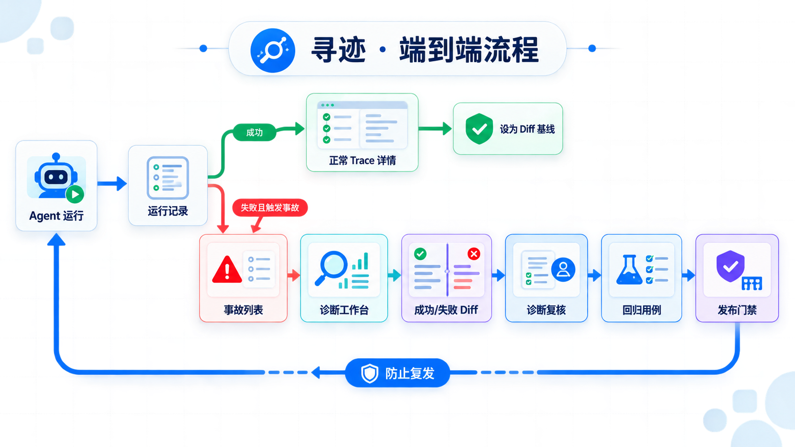
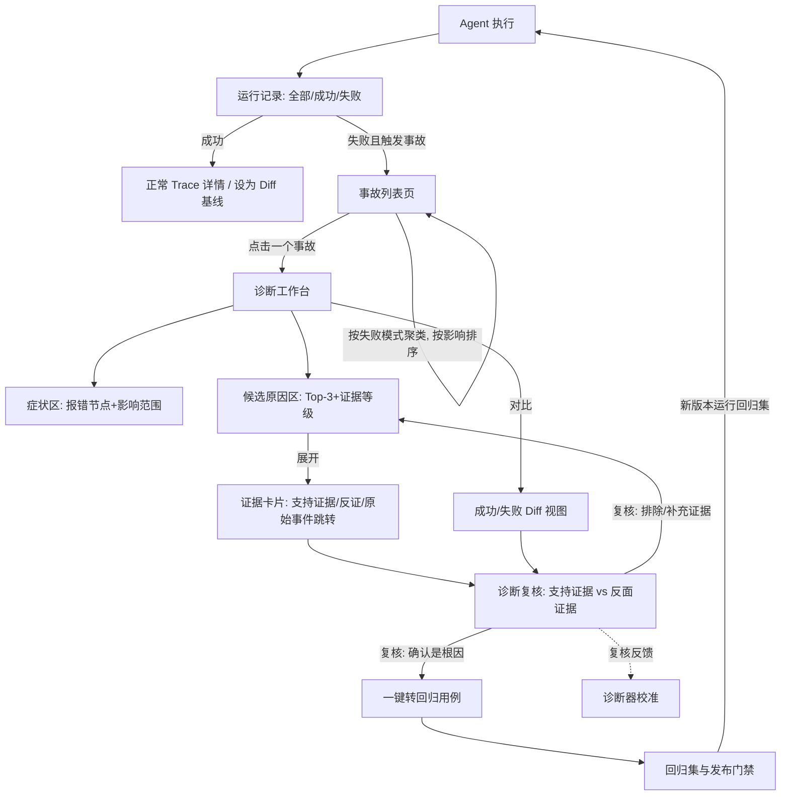

> 提交状态：已完成
> 核心交付：端到端流程、步骤输入输出、5 个主导航、分类与状态口径
> 上游依据：[项目索引](../评分索引.md) · 下游证据：[原型](../prototype/index.html)



# 任务 1：核心流程设计

### 1.1 主流程

本期选定场景为「单 Agent 多步骤执行中的因果故障定位与证据化回放」，主流程覆盖从问题触发到复发预防的完整闭环；多 Agent 仅作为后续数据模型扩展方向。



### 1.2 步骤级说明

| 步骤 | 输入 | 用户决策点 | 输出 | 对应页面 |
|---|---|---|---|---|
| 1. 触发 | 告警规则命中 / Judge（评审器）低分 / 手动上报 | 无（系统自动） | 新事故记录，归入失败模式簇 | — |
| 1A. 浏览运行 | 成功与失败 Trace 摘要 | 查看哪次执行、是否筛选状态 | 正常 Trace 详情或关联事故 | 运行记录 |
| 2. 浏览事故 | 事故列表 + 失败模式聚类 | 先处理哪个簇/事故（按影响面排序辅助） | 选中一个事故 | 事故列表页 |
| 3. 看诊断 | 首故障点标注 + Top-3 候选原因 + 证据等级 | 是否采信候选、看哪条证据 | 理解「哪一步先出的错」 | 诊断工作台 |
| 4. 查证据 | 证据卡片（Span ID、状态 Diff、工具参数）+ 反证 | 证据是否充分 | 形成个人判断 | 证据卡片抽屉 |
| 5. 比 Diff | 同类成功链 vs 失败链的状态/传参/工具对比 | 差异是否解释失败 | 确认或排除候选 | Diff 视图 |
| 6. 复核 | 支持证据 + 反面证据与其他解释并排呈现 | **确认是根因 / 排除该原因 / 暂需补充证据**（必选其一） | 复核记录 + 校准信号 | 诊断复核 |
| 7. 转用例 | 已确认根因的事故（输入、上下文、期望不变量） | 用例归入哪个回归集 | 回归用例（含脱敏快照） | 转用例弹窗 |
| 8. 门禁 | 新版本对回归集的运行结果 | 警告后是否放行（默认警告不阻断） | 发布检查报告 | 门禁页 |

### 1.3 信息架构（站点地图）

第一期只保留 5 个主导航。诊断工作台、Diff 与复核不是三个独立产品模块，而是事故详情内的连续子视图，避免一次排障被拆散。

```text
寻迹
├─ 运行记录
│  ├─ 执行状态 / 质量结论 / Agent / 运行名称 / 版本 / 时间筛选
│  ├─ 正常与异常 Trace 详情
│  └─ 选择符合条件的 Diff 基线
├─ 事故
│  ├─ 失败模式簇与事故列表
│  └─ 事故详情：诊断工作台 → 证据 → Diff → 复核
├─ 回归与门禁
│  ├─ 已复核事故生成的回归用例
│  └─ 发布检查报告（通过 / 警告 / 阻断）
├─ 接入与体检
│  ├─ OTLP 与框架适配
│  └─ 完整度、断链、重复和敏感字段检查
└─ 设置
   └─ 项目、成员权限、脱敏策略、告警与门禁模式
```

主导航遵循工程后台的常见结构；创新只落在事故详情中的证据组织与闭环效率。运行记录是全量事实入口，事故是需要处理的问题入口，两者不再混用。

### 1.4 统一分类与状态口径

`step_type` 是寻迹的内部归一化字段，不冒充 OpenTelemetry 标准枚举；接入层同时保留框架原值与 GenAI 语义约定。

| 层级 | 定义 | 示例 |
|---|---|---|
| Agent / 运行名称 | 业务归属与一次运行的语义 | 订单助手 / 退款处理、订单改址 |
| 原始步骤类型 `raw_step_type` | 框架或 SDK 原始值 | `chain`、`tool_node`、`model` |
| OTel / GenAI 语义 | 标准 span kind 与 `gen_ai.operation.name` | `CLIENT`、`INTERNAL`；`invoke_agent`、`execute_tool` |
| 归一步骤类型 `step_type` | 寻迹内部稳定枚举 | `AGENT`、`LLM`、`TOOL`、`RETRIEVAL`、`MEMORY`、`STATE`、`HANDOFF`、`GUARDRAIL`、`ENTRY`、`OUTPUT`、`OTHER` |
| 步骤名称 `step_name` | 具体业务节点名 | 生成退款计划、检索退款政策、调用 refund_api |
| 故障类型 `failure_type` | 事故现象，与步骤类型正交；九类枚举以 [00-故障分类与案例事实源.md](00-故障分类与案例事实源.md) 为准 | `STALE_STATE` 状态过期、`CONTRACT` 契约异常、`TOOL_CALL` 工具调用异常、`RETRIEVAL_EMPTY` 检索为空、`MODEL_OUTPUT` 模型输出异常、`ORCHESTRATION` 编排异常、`RETRIEVAL_DRIFT` 检索排序漂移、`CONTEXT_CONFLICT` 多轮上下文冲突、`RETRY_AMPLIFICATION` 重试状态放大 |

状态拆成三个正交维度：`execution_status` 表示技术执行是否完成，`quality_verdict` 表示业务质量是否通过或未知，`incident_status` 表示是否触发事故及其处理进度。因此“接口返回 200”不等于“答案正确”，正常 Trace 与语义失败 Trace 都会在运行记录中出现。

**分类的「低成本解法」维度与 T1/T2 边界（依据 [00-故障分类与案例事实源.md](00-故障分类与案例事实源.md)）：** 九类故障新增一个评估维度——有无低成本解法。FM-01～FM-06 中的多数可以靠工程规范预防（TTL、Schema 校验、重试熔断、兜底话术等）；只有 FM-07 检索排序漂移、FM-08 多轮上下文冲突、FM-09 重试状态放大是「无低成本解法」的——它们执行层全部成功、故障由业务侧发现、根因是复合条件、证据必须跨步骤比对，没有一行配置能预防，因此是价值论证与演示主线的依据。能力阶段标注：FM-02/03/04 判定路径 T1 已实现，FM-05 T1 部分实现，FM-01/06/07/08/09 属 T2 设计中（尚未实现，不作为已交付能力表述）。产品对全部九类提供诊断，价值密度不同。

---

## 交付闭环

| 检查项 | 结果 |
|---|---|
| 本任务产出 | 端到端流程、步骤输入输出、5 个主导航、分类与状态口径 |
| 核验方式 | 流程节点与原型页面逐项对照；流程图资源存在 |
| 当前状态 | 已完成 |
| 剩余风险 | 多 Agent 只保留数据模型扩展位 |
