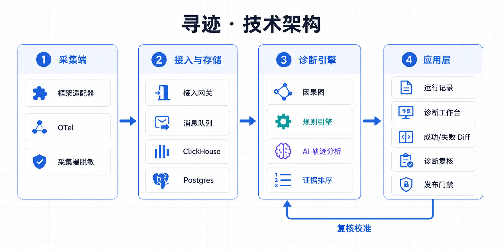
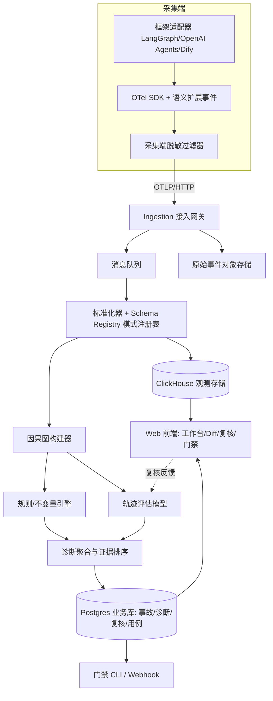

> 提交状态：已完成
> 核心交付：架构、接口、数据结构、规则与模型时序
> 上游依据：[项目索引](../评分索引.md) · 下游证据：[原型](../prototype/index.html)



# 任务 8：技术方案草图

第一周 11.2 节推荐架构，不推翻，细化到接口与字段。

### 8.1 高层架构



### 8.2 核心接口草案

OTLP/HTTP 使用标准接收路径 `POST /v1/traces`；租户鉴权和项目路由由请求头或网关配置承载，不改写标准路径。产品查询接口位于寻迹自己的 `/v1/projects/...` 命名空间。

| 方法与路径 | 用途 | 关键契约 |
|---|---|---|
| `POST /v1/traces` | OTLP Trace 接入 | protobuf/JSON；202；扩展业务属性放 `xunji.*`，标准 GenAI 属性原样保留 |
| `GET /v1/projects/{pid}/checkup` | 采集体检 | 完整度、断链、重复、敏感字段隔离结果与修复指引 |
| `GET /v1/projects/{pid}/traces` | 运行记录 | 筛选 `execution_status`、`quality_verdict`、`incident_status`、agent、run、version、time、trace_id |
| `GET /v1/traces/{tid}` | Trace 详情 | 层级关系、会话/运行信息、输入输出引用、步骤与关联事故 |
| `GET /v1/projects/{pid}/incidents` | 事故与聚类 | 筛选 failure/step/name/time/review/evidence_grade，返回症状簇与事故摘要 |
| `GET /v1/incidents/{iid}/diagnosis` | 诊断快照 | `status: pending|partial|complete|failed`，返回当前候选、证据与 causal path |
| `GET /v1/incidents/{iid}/diagnosis/events` | 诊断增量 | SSE 推送候选、证据和完成/失败事件；不支持 SSE 时轮询上一接口 |
| `GET /v1/incidents/{iid}/diff?baseline={tid}` | 成功/失败 Diff | 三类 Diff、基线兼容性与推荐依据 |
| `POST /v1/candidates/{cid}/review` | 提交复核 | `result: confirmed|excluded|insufficient`；If-Match 控制并发 |
| `POST /v1/incidents/{iid}/regression-case` | 转回归用例 | 仅允许 confirmed；打包脱敏输入、上下文引用和不变量 |
| `POST /v1/suites/{sid}/gate-run` | 门禁运行 | `mode: warn|block`；返回 pass/warn/block 及逐用例结果 |

### 8.3 核心数据结构（字段级）

**观测侧（ClickHouse）：** 所有表显式包含 `tenant_id`、`project_id`；按租户、项目和日期分区，按 `trace_id, ts` 排序。

```text
spans
  tenant_id, project_id
  trace_id, span_id, parent_span_id, ts, duration_ms
  conversation_id, session_id
  run_id, root_run_id, parent_run_id, attempt
  agent_id, agent_version, workflow_name, run_name
  span_kind, gen_ai_operation_name
  raw_step_type, step_type, step_name
  execution_status, quality_verdict
  input_ref, output_ref, attrs, link_kind

events_state
  tenant_id, project_id, trace_id, span_id, ts
  state_key, before_hash, after_hash, diff_ref
  writer_span_id, reader_span_id, snapshot_version, snapshot_age_s

events_handoff
  tenant_id, project_id, trace_id, span_id, ts
  source_span_id, target_span_id, contract_version
  fields_present, fields_missing, payload_ref, accepted, reject_reason

events_memory
  tenant_id, project_id, trace_id, span_id, ts
  memory_id, version, op, source, retrieval_score, written_at
```

**业务侧（Postgres）：**

```text
incidents(id, tenant_id, project_id, trace_id, cluster_id, failure_type,
          symptom_span_id, execution_status, quality_verdict,
          incident_status, review_status, evidence_grade, created_at)
failure_clusters(id, project_id, symptom_signature, cause_signature,
          signature_version, title, count_24h, trend, merged_into, created_at)
diagnoses(id, incident_id, status, model_version, rule_pack_version,
          started_at, completed_at, failure_reason)
candidates(id, diagnosis_id, rank, cause_type, summary, raw_score,
          evidence_grade, calibration_version, source,
          first_fault_span_id, causal_path)
evidence(id, candidate_id, side, kind, span_ref, event_ref, excerpt, weight)
verdicts(id, candidate_id,
          result ENUM(confirmed, excluded, insufficient),
          reason_code, correct_cause_ref, decided_by, decided_at, superseded_by)
regression_cases(id, incident_id, suite_id, input_ref,
          context_snapshot_ref, invariants, review_status)
gate_runs(id, suite_id, release, mode, result, detail, created_at)
```

约束：每条 evidence 的 `span_ref` 或 `event_ref` 至少一个存在；`raw_score` 不直接展示给用户；复核枚举在 API 与数据库中保持一致。

### 8.4 规则引擎与轨迹模型的分工与时序

**分工边界（依据第一周 7.2 节原则 1–2）：**

| 层 | 处理内容 | 输出 | 示例 |
|---|---|---|---|
| 规则/不变量引擎（先跑，毫秒级） | 确定性可判定问题：Schema 校验、必填字段、状态机不变量、快照过期阈值、数值约束、权限决策 | `规则判定` 候选，内部原始分数按规则强度记录，仅用于排序与离线校准 | `snapshot_age_s > 3600 且下游读取 → 状态过期候选` |
| 轨迹评估模型（后跑，秒级，异步） | 语义问题：因果候选排序、替代解释生成、反证搜集、答案语义偏差 | `模型推断` 候选 + 反证；输出必须是结构化证据引用，自由文本仅作 summary | 「契约缺 currency 字段」是否真为因 → 检索历史成功链反证 |
| 诊断聚合器 | 合并去重、证据加权排序、内部评分校准、证据等级映射与 Top-3 截断 | 诊断对象 | — |

**调用时序：** 事故创建 → 因果图构建（同步，< 1s）→ 规则引擎（同步）→ **先返回规则结果渲染页面** → 模型分析（异步，30s 超时）→ 增量推送模型候选与反证 → 用户复核 → 复核写入校准日志 → 定期（周）用复核数据评估规则阈值与模型 prompt/参数。模型失败不阻塞页面（对应异常 G-4）。该时序在原型中以「诊断加载中」微交互真实呈现（见 11.2 节节点 1）。

---

## 交付闭环

| 检查项 | 结果 |
|---|---|
| 本任务产出 | 架构、接口、数据结构、规则与模型时序 |
| 核验方式 | 接口枚举、字段、异步通道与存储分区一致性检查 |
| 当前状态 | 已完成 |
| 剩余风险 | GenAI 语义属性仍需随 OTel 版本复核 |
